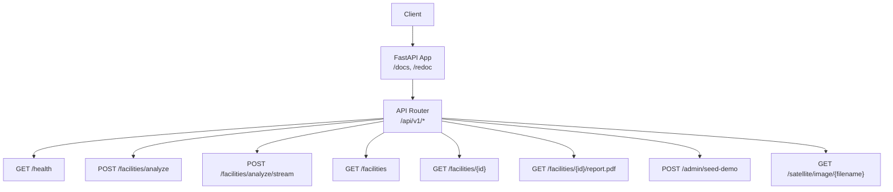
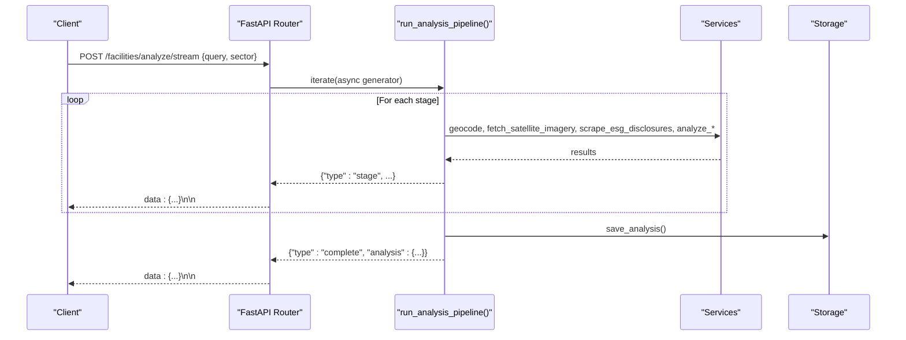
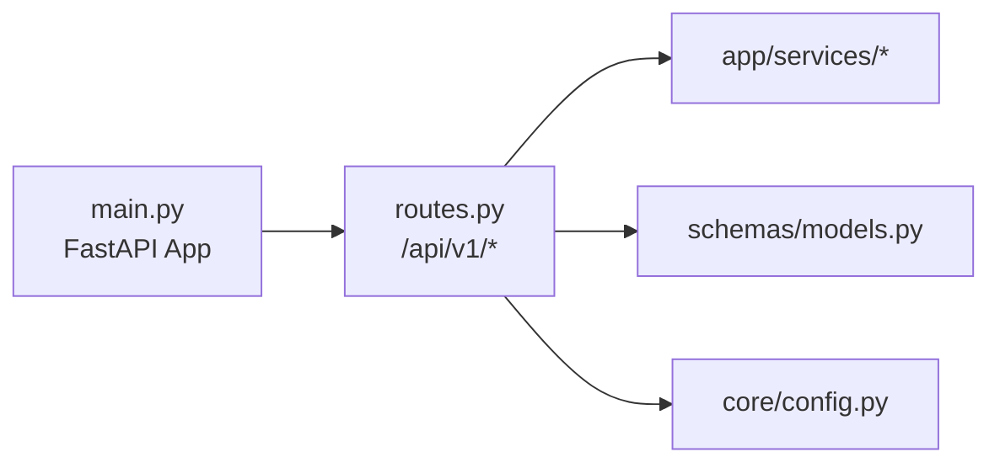

# API Reference

<cite>
**Referenced Files in This Document**
- [main.py](file://backend/main.py)
- [routes.py](file://backend/app/api/v1/routes.py)
- [models.py](file://backend/app/schemas/models.py)
- [config.py](file://backend/app/core/config.py)
- [api.ts](file://frontend/src/api.ts)
- [types/index.ts](file://frontend/src/types/index.ts)
</cite>

## Table of Contents
1. [Introduction](#introduction)
2. [Project Structure](#project-structure)
3. [Core Components](#core-components)
4. [Architecture Overview](#architecture-overview)
5. [Detailed Component Analysis](#detailed-component-analysis)
6. [Dependency Analysis](#dependency-analysis)
7. [Performance Considerations](#performance-considerations)
8. [Troubleshooting Guide](#troubleshooting-guide)
9. [Conclusion](#conclusion)
10. [Appendices](#appendices)

## Introduction
This document provides comprehensive API documentation for Carbon Compass REST endpoints and the Server-Sent Events (SSE) streaming interface. It covers HTTP methods, URL patterns, request/response schemas, authentication, error handling, rate limiting considerations, versioning, and client implementation guidelines for both synchronous and streaming calls.

The API is built with FastAPI and exposes a v1 namespace under /api/v1. It supports:
- Health checks
- Facility analysis (synchronous and streaming)
- Listing and retrieving analyses
- PDF report export
- Demo seeding
- Satellite image retrieval

## Project Structure
The backend application registers middleware (CORS), includes the v1 router, and defines a root endpoint. The v1 router implements all documented endpoints and shares a common analysis pipeline used by both the synchronous and streaming endpoints. Pydantic models define request validation and response serialization. The frontend demonstrates how to call these APIs, including SSE parsing.

**Diagram sources**
- [main.py:19-41](file://backend/main.py#L19-L41)
- [routes.py:35-299](file://backend/app/api/v1/routes.py#L35-L299)

**Section sources**
- [main.py:19-52](file://backend/main.py#L19-L52)
- [routes.py:35-299](file://backend/app/api/v1/routes.py#L35-L299)

## Core Components
- Request/Response Models: Defined using Pydantic for validation and serialization.
- Analysis Pipeline: Shared async generator that yields stage events, completion, or errors. Used by both POST /facilities/analyze and POST /facilities/analyze/stream.
- Storage and Services: Geocoding, satellite imagery, ESG scraping, AI cross-analysis, shipping activity, scoring, PDF generation, and demo seeding are invoked within the pipeline and endpoints.

Key model groups:
- AnalyzeRequest: Validates query and optional sector.
- FacilityAnalysis: Full analysis result returned by complete events and GET /facilities/{id}.
- HealthResponse: Health status, version, mock mode, and API capabilities.
- AnalysisListResponse: Paginated-style list wrapper for facilities.

**Section sources**
- [models.py:20-78](file://backend/app/schemas/models.py#L20-L78)
- [routes.py:68-206](file://backend/app/api/v1/routes.py#L68-L206)

## Architecture Overview
The system processes facility analysis through a multi-stage pipeline:
1. Geocoding & Satellite Imagery
2. ESG Disclosure Scanning
3. AI Cross-Analysis (vision + text + discrepancies)
4. Risk Scoring

Each stage emits progress events via the shared pipeline generator. The synchronous endpoint returns only the final result; the streaming endpoint emits each event as an SSE data frame.

**Diagram sources**
- [routes.py:68-206](file://backend/app/api/v1/routes.py#L68-L206)
- [routes.py:236-251](file://backend/app/api/v1/routes.py#L236-L251)

## Detailed Component Analysis

### Authentication and Security
- No explicit authentication middleware is implemented in the provided codebase. Access control is not enforced at the API layer.
- CORS is configured to allow specified origins with credentials.
- Credentials (API keys) are loaded from environment variables and not exposed in responses except capability flags in health.

Recommendations:
- Add an authentication/authorization layer (e.g., JWT, API key header validation).
- Consider adding rate limiting middleware to protect endpoints, especially streaming and admin routes.

**Section sources**
- [main.py:31-39](file://backend/main.py#L31-L39)
- [routes.py:208-223](file://backend/app/api/v1/routes.py#L208-L223)
- [config.py:6-37](file://backend/app/core/config.py#L6-L37)

### Versioning
- API version is embedded in the router prefix (/api/v1) and reported in health responses and app metadata.
- Keep backward compatibility when evolving schemas; introduce new versions for breaking changes.

**Section sources**
- [routes.py:35](file://backend/app/api/v1/routes.py#L35)
- [main.py:19-29](file://backend/main.py#L19-L29)
- [routes.py:208-223](file://backend/app/api/v1/routes.py#L208-L223)

### Endpoints

#### GET /api/v1/health
- Purpose: Service health and capability status.
- Response schema: HealthResponse
- Notes: Indicates mock/live modes for geocoding, sentinel hub, qwen, OSS, and shipping.

Example response fields:
- status: string
- version: string
- mock_mode: boolean
- apis: object mapping service names to "live"/"mock"/"local_cache"/"mock_proxy"

**Section sources**
- [routes.py:208-223](file://backend/app/api/v1/routes.py#L208-L223)
- [models.py:68-73](file://backend/app/schemas/models.py#L68-L73)

#### POST /api/v1/facilities/analyze
- Purpose: Run the full analysis synchronously and return the final result once complete.
- Request body: AnalyzeRequest
- Response: FacilityAnalysis
- Error handling: Returns 422 if pipeline emits an error event; otherwise returns 200 with analysis.

Request schema:
- query: string (required, 1–500 chars)
- sector: string | null (optional)

Response schema:
- FacilityAnalysis (see Appendix A)

Error codes:
- 422: Pipeline error (e.g., geocoding failure)
- 500: Unexpected pipeline termination without result

**Section sources**
- [routes.py:226-233](file://backend/app/api/v1/routes.py#L226-L233)
- [models.py:20-31](file://backend/app/schemas/models.py#L20-L31)
- [models.py:46-66](file://backend/app/schemas/models.py#L46-L66)

#### POST /api/v1/facilities/analyze/stream (SSE)
- Purpose: Stream analysis progress and final result using Server-Sent Events.
- Request body: AnalyzeRequest
- Response: text/event-stream with frames formatted as data: {json}\n\n
- Event types:
  - type: "stage" — progress updates per stage
  - type: "complete" — final analysis result
  - type: "error" — pipeline error message

Stage values:
- geocoding_satellite
- disclosure_scanning
- ai_cross_analysis
- risk_scoring

Stage event fields:
- type: "stage"
- stage: one of the above
- status: "running" | "completed"
- detail: human-readable status
- image_reference?: string | null (when available)
- acquisition_date?: string | null (when available)

Complete event fields:
- type: "complete"
- analysis: FacilityAnalysis

Error event fields:
- type: "error"
- error: string

Connection handling:
- StreamingResponse with media_type "text/event-stream"
- Headers include Cache-Control: no-cache and X-Accel-Buffering: no to prevent buffering

Client guidance:
- Use fetch with POST and read the ReadableStream body
- Parse frames split by double newline, extract lines starting with "data: ", parse JSON
- Handle abort signals to cancel long-running streams

**Section sources**
- [routes.py:68-206](file://backend/app/api/v1/routes.py#L68-L206)
- [routes.py:236-251](file://backend/app/api/v1/routes.py#L236-L251)
- [api.ts:52-108](file://frontend/src/api.ts#L52-L108)
- [types/index.ts:52-79](file://frontend/src/types/index.ts#L52-L79)

#### GET /api/v1/facilities
- Purpose: List stored analyses, optionally filtered by sector.
- Query parameters:
  - sector: string | undefined (filter; use "all" or omit to get all)
- Response schema: AnalysisListResponse
- Notes: Sector filtering is case-insensitive.

**Section sources**
- [routes.py:254-261](file://backend/app/api/v1/routes.py#L254-L261)
- [models.py:75-78](file://backend/app/schemas/models.py#L75-L78)

#### GET /api/v1/facilities/{id}
- Purpose: Retrieve a specific analysis by ID.
- Path parameter:
  - id: string (analysis_id)
- Response schema: FacilityAnalysis
- Errors:
  - 404: Not found

**Section sources**
- [routes.py:264-269](file://backend/app/api/v1/routes.py#L264-L269)
- [models.py:46-66](file://backend/app/schemas/models.py#L46-L66)

#### GET /api/v1/facilities/{id}/report.pdf
- Purpose: Generate and download a PDF report for an analysis.
- Path parameter:
  - id: string (analysis_id)
- Response: application/pdf with Content-Disposition attachment
- Errors:
  - 404: Not found

**Section sources**
- [routes.py:272-284](file://backend/app/api/v1/routes.py#L272-L284)

#### POST /api/v1/admin/seed-demo
- Purpose: Seed demo data for development/testing.
- Request body: none
- Response:
  - status: string
  - seeded_count: number
  - facility_ids: string[]
- Security note: Admin-only operation; currently unprotected.

**Section sources**
- [routes.py:287-290](file://backend/app/api/v1/routes.py#L287-L290)

#### GET /api/v1/satellite/image/{filename}
- Purpose: Serve a previously saved satellite image by filename.
- Path parameter:
  - filename: string
- Response: image/png file
- Errors:
  - 404: Image not found

**Section sources**
- [routes.py:293-299](file://backend/app/api/v1/routes.py#L293-L299)

### SSE Streaming Interface Details
- Connection: POST to /api/v1/facilities/analyze/stream with JSON body.
- Frame format: Each event is emitted as a line beginning with "data: " followed by a JSON payload, terminated by two newlines.
- Event lifecycle:
  - Multiple "stage" events indicate progress across stages.
  - One "complete" event contains the final FacilityAnalysis.
  - An "error" event indicates a fatal issue; clients should stop processing and surface the error.
- Real-time interaction pattern:
  - Start stream on user action (e.g., submit analysis).
  - Update UI incrementally on each "stage" event.
  - On "complete", render final results and persist IDs for later retrieval.
  - On "error", show user-friendly message and allow retry.

**Section sources**
- [routes.py:68-206](file://backend/app/api/v1/routes.py#L68-L206)
- [routes.py:236-251](file://backend/app/api/v1/routes.py#L236-L251)
- [api.ts:52-108](file://frontend/src/api.ts#L52-L108)

### Request/Response Examples
Note: Replace placeholders with actual values.

- GET /api/v1/health
  - Response example:
    - {
        "status": "ok",
        "version": "1.0.0",
        "mock_mode": true,
        "apis": {
          "geocoding": "mock",
          "sentinel_hub": "mock",
          "qwen": "mock",
          "oss": "local_cache",
          "shipping": "mock_proxy"
        }
      }

- POST /api/v1/facilities/analyze
  - Request example:
    - {
        "query": "Company Name, City, Country",
        "sector": "textile"
      }
  - Response example:
    - FacilityAnalysis (see Appendix A)

- POST /api/v1/facilities/analyze/stream
  - Request example: same as above
  - Streamed events examples:
    - data: {"type":"stage","stage":"geocoding_satellite","status":"running","detail":"Resolving..."}
    - data: {"type":"stage","stage":"geocoding_satellite","status":"completed","detail":"Resolved to lat, lng.","image_reference":"...","acquisition_date":"..."}
    - data: {"type":"stage","stage":"disclosure_scanning","status":"running","detail":"Scanning disclosures..."}
    - data: {"type":"stage","stage":"ai_cross_analysis","status":"completed","detail":"Identified N risk signal(s)."}
    - data: {"type":"stage","stage":"risk_scoring","status":"completed","detail":"Overall risk score X/100 (band)."}
    - data: {"type":"complete","analysis":{...FacilityAnalysis...}}

- GET /api/v1/facilities?sector=textile
  - Response example:
    - {
        "facilities": [...],
        "total": 12
      }

- GET /api/v1/facilities/{id}
  - Response example: FacilityAnalysis

- GET /api/v1/facilities/{id}/report.pdf
  - Response: Binary PDF content with appropriate headers

- POST /api/v1/admin/seed-demo
  - Response example:
    - {
        "status": "ok",
        "seeded_count": 5,
        "facility_ids": ["cc-...","cc-..."]
      }

- GET /api/v1/satellite/image/{filename}
  - Response: PNG image bytes

**Section sources**
- [routes.py:208-299](file://backend/app/api/v1/routes.py#L208-L299)
- [models.py:20-78](file://backend/app/schemas/models.py#L20-L78)

### Error Handling Strategies
- Validation errors: FastPydantic returns 422 for invalid requests (e.g., missing or out-of-range fields).
- Pipeline errors: The streaming endpoint emits type "error" events; the synchronous endpoint raises HTTPException(422) with the error detail.
- Not found: 404 for missing analyses or images.
- Unexpected failures: 500 if the pipeline ends without a result.

Client best practices:
- Always handle non-OK responses and parse error payloads where possible.
- For SSE, treat "error" events as terminal and surface messages to users.
- Implement retries with exponential backoff for transient network issues.

**Section sources**
- [routes.py:226-233](file://backend/app/api/v1/routes.py#L226-L233)
- [routes.py:264-299](file://backend/app/api/v1/routes.py#L264-L299)

### Rate Limiting Considerations
- No rate limiting middleware is present in the current codebase.
- Recommended approach:
  - Add a rate limiter (e.g., per IP or per user token) for streaming and admin endpoints.
  - Enforce timeouts and cancellation support on the client side.
  - Monitor server resources and adjust limits based on load.

[No sources needed since this section provides general guidance]

### Pydantic Schema Models
- AnalyzeRequest: query (string, required), sector (string | null, optional)
- FacilityAnalysis: analysis_id, company_name, display_name, latitude, longitude, sector, region, risk_score, risk_band, overall_confidence, overall_status, components, risk_signals, rationale, image_reference, acquisition_date, disclosure_sources, missing_sources, analyzed_at
- HealthResponse: status, version, mock_mode, apis
- AnalysisListResponse: facilities (list of FacilityAnalysis), total
- Enums: RiskBand (low, medium, high, unknown), ComponentStatus (ok, insufficient_data, error)

These models enforce input validation and ensure consistent output serialization.

**Section sources**
- [models.py:7-18](file://backend/app/schemas/models.py#L7-L18)
- [models.py:20-78](file://backend/app/schemas/models.py#L20-L78)

### Client Implementation Guidelines

#### Synchronous Calls (JavaScript/TypeScript)
- Use axios or fetch to call endpoints like /api/v1/facilities/analyze and /api/v1/facilities/{id}.
- Handle timeouts and parse JSON responses into typed interfaces matching FacilityAnalysis and others.
- Example references:
  - Base URL configuration and helper functions are demonstrated in the frontend API module.

**Section sources**
- [api.ts:1-50](file://frontend/src/api.ts#L1-L50)
- [types/index.ts:1-50](file://frontend/src/types/index.ts#L1-L50)

#### Streaming Calls (SSE)
- Use fetch with method POST and JSON body to /api/v1/facilities/analyze/stream.
- Read the response body as a stream, buffer chunks, split by double newline, parse "data: ..." lines.
- Emit events to your UI layer to update progress and render final results.
- Support AbortSignal to cancel ongoing streams.

Reference implementation:
- The frontend function streamAnalysis shows how to parse SSE frames and handle errors.

**Section sources**
- [api.ts:52-108](file://frontend/src/api.ts#L52-L108)
- [types/index.ts:52-79](file://frontend/src/types/index.ts#L52-L79)

## Dependency Analysis
The v1 router depends on services for geocoding, satellite imagery, ESG scraping, AI analysis, shipping activity, scoring, storage, and report generation. The main app wires CORS and includes the router.

**Diagram sources**
- [main.py:19-41](file://backend/main.py#L19-L41)
- [routes.py:10-33](file://backend/app/api/v1/routes.py#L10-L33)
- [config.py:6-37](file://backend/app/core/config.py#L6-L37)

**Section sources**
- [main.py:19-41](file://backend/main.py#L19-L41)
- [routes.py:10-33](file://backend/app/api/v1/routes.py#L10-L33)

## Performance Considerations
- Streaming reduces perceived latency by rendering progress incrementally.
- Avoid buffering SSE responses; headers disable proxy buffering.
- Consider caching repeated queries for identical inputs if appropriate.
- Monitor external service latency (geocoding, satellite, AI) and implement timeouts/retries.
- For large datasets, paginate or filter lists (e.g., sector filter already supported).

[No sources needed since this section provides general guidance]

## Troubleshooting Guide
Common issues and resolutions:
- Geocoding failure: The pipeline emits an error event with guidance to use GPS coordinates. Retry with precise coordinates.
- Missing satellite imagery: Stage completes with a note indicating insufficient data; downstream components may be marked accordingly.
- No ESG disclosures: Pipeline proceeds with insufficient data; risk scoring reflects lower confidence.
- Not found errors: Ensure analysis_id exists before requesting details or reports.
- CORS errors: Verify allowed origins in configuration match your frontend origin.

Operational tips:
- Check /api/v1/health to confirm which components are live vs mock.
- Use /api/v1/facilities to verify stored analyses and their IDs.
- Inspect logs for service-level errors during analysis.

**Section sources**
- [routes.py:68-206](file://backend/app/api/v1/routes.py#L68-L206)
- [routes.py:208-223](file://backend/app/api/v1/routes.py#L208-L223)

## Conclusion
Carbon Compass provides a robust set of endpoints for sustainability risk analysis, with both synchronous and streaming interfaces. The SSE streaming endpoint enables real-time feedback during multi-stage analysis. Follow the client guidelines to integrate effectively, and consider adding authentication and rate limiting for production deployments.

[No sources needed since this section summarizes without analyzing specific files]

## Appendices

### Appendix A: FacilityAnalysis Schema
Fields:
- analysis_id: string
- company_name: string
- display_name: string
- latitude: number
- longitude: number
- sector: string
- region: string
- risk_score: number | null
- risk_band: enum (low, medium, high, unknown)
- overall_confidence: number | null
- overall_status: string
- components: array of ComponentResult
- risk_signals: array of strings
- rationale: string
- image_reference: string | null
- acquisition_date: string | null
- disclosure_sources: array of strings
- missing_sources: array of strings
- analyzed_at: datetime

ComponentResult fields:
- name: string
- label: string
- weight: number
- status: enum (ok, insufficient_data, error)
- score: number | null
- confidence: number | null
- rationale: string
- observations: array of strings
- risk_indicators: array of strings
- extracted_claims: array of strings

**Section sources**
- [models.py:7-18](file://backend/app/schemas/models.py#L7-L18)
- [models.py:33-66](file://backend/app/schemas/models.py#L33-L66)

### Appendix B: SSE Event Types Summary
- stage:
  - Fields: type, stage, status, detail, optional image_reference, acquisition_date
- complete:
  - Fields: type, analysis (FacilityAnalysis)
- error:
  - Fields: type, error (string)

**Section sources**
- [routes.py:68-206](file://backend/app/api/v1/routes.py#L68-L206)
- [types/index.ts:52-79](file://frontend/src/types/index.ts#L52-L79)