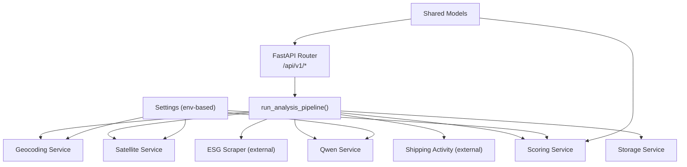
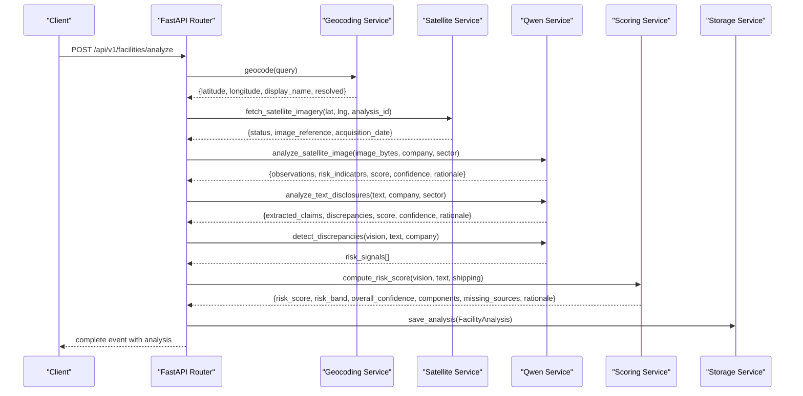
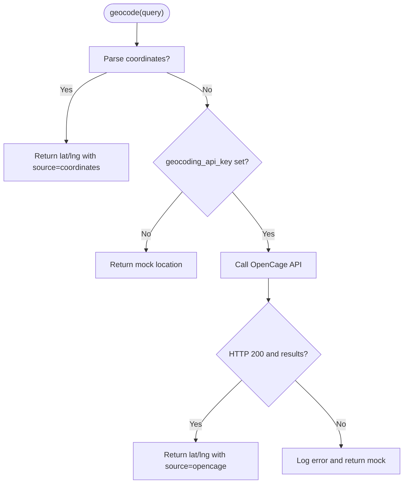
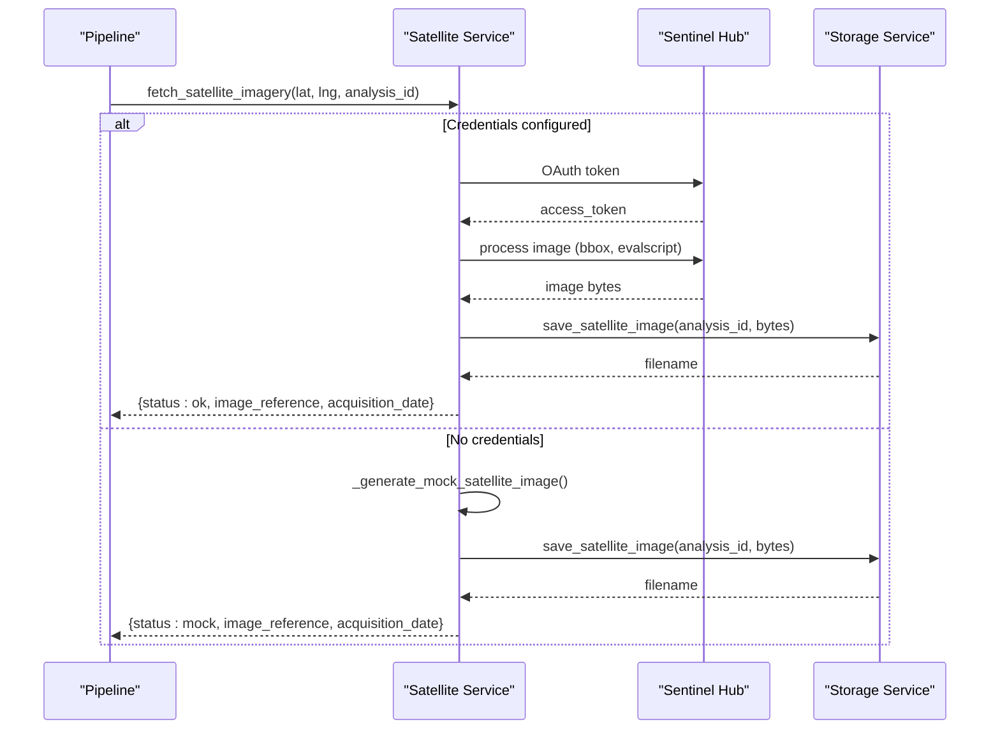
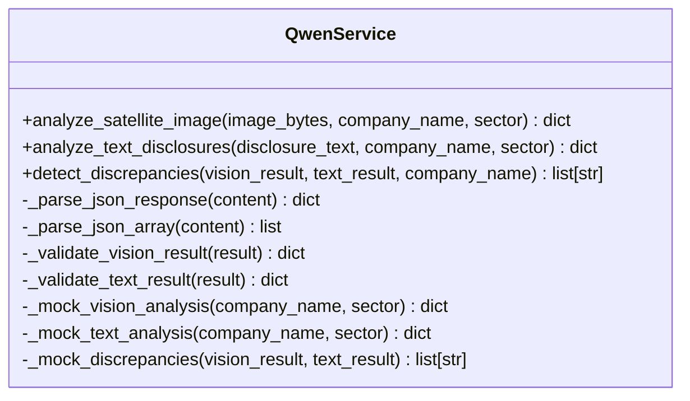
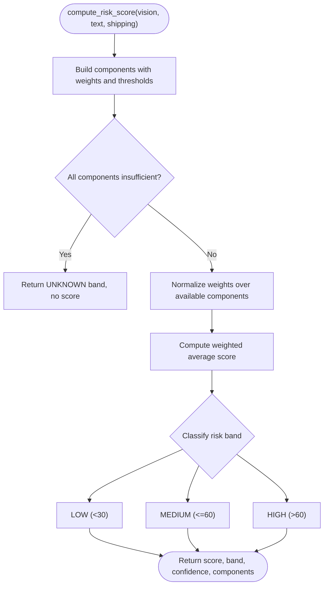
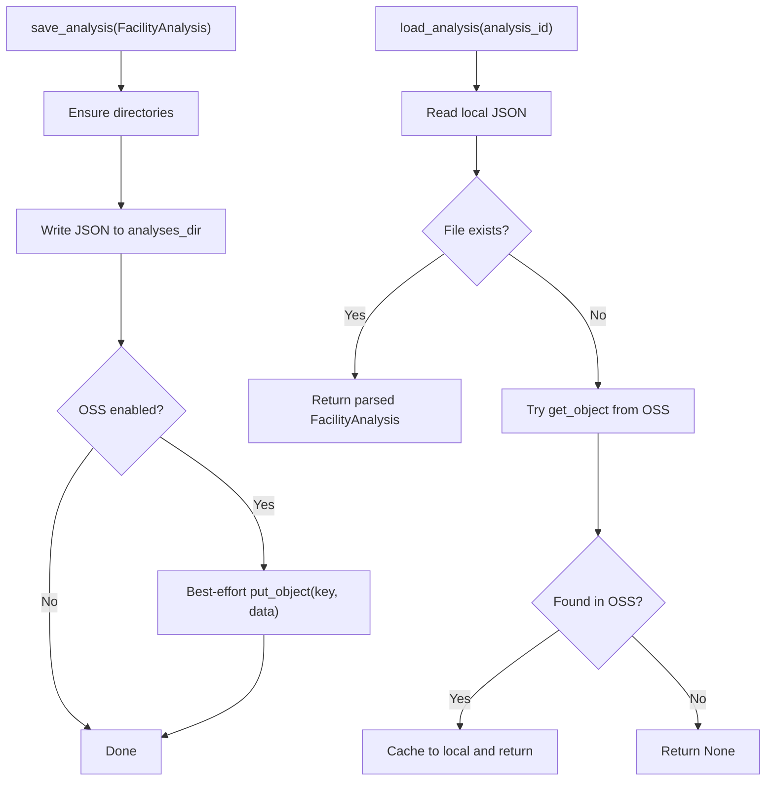
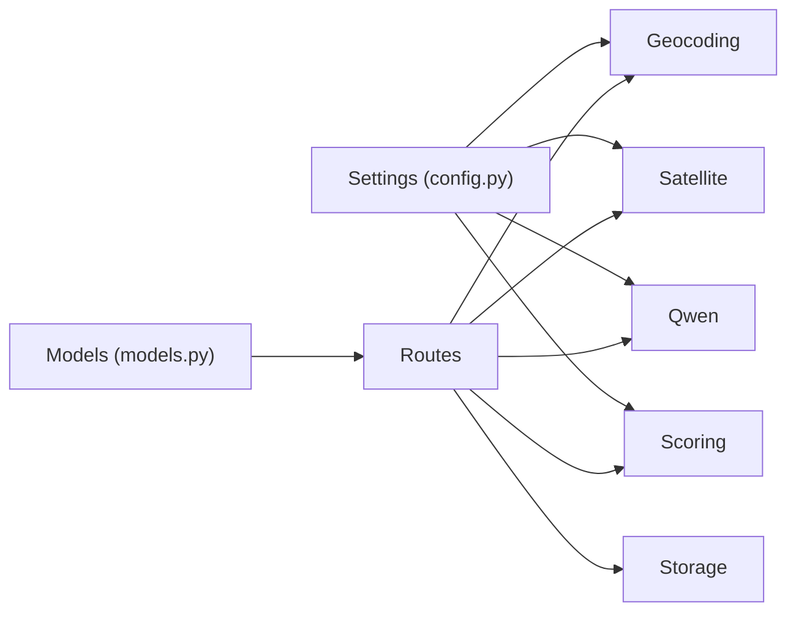

# Core Services

<cite>
**Referenced Files in This Document**
- [geocoding.py](file://backend/app/services/geocoding.py)
- [satellite.py](file://backend/app/services/satellite.py)
- [qwen.py](file://backend/app/services/qwen.py)
- [scoring.py](file://backend/app/services/scoring.py)
- [storage.py](file://backend/app/services/storage.py)
- [config.py](file://backend/app/core/config.py)
- [models.py](file://backend/app/schemas/models.py)
- [routes.py](file://backend/app/api/v1/routes.py)
</cite>

## Table of Contents
1. [Introduction](#introduction)
2. [Project Structure](#project-structure)
3. [Core Components](#core-components)
4. [Architecture Overview](#architecture-overview)
5. [Detailed Component Analysis](#detailed-component-analysis)
6. [Dependency Analysis](#dependency-analysis)
7. [Performance Considerations](#performance-considerations)
8. [Troubleshooting Guide](#troubleshooting-guide)
9. [Conclusion](#conclusion)

## Introduction
This document explains the five core services that power the Carbon Compass analysis pipeline: Geocoding, Satellite, Qwen (AI vision and text), Scoring, and Storage. It covers service interfaces, configuration-driven behavior (mock vs live), error handling patterns, integration points, and concrete invocation flows as implemented in the codebase. The goal is to make the system understandable for both technical and non-technical readers while remaining grounded in the actual implementation.

## Project Structure
The backend exposes a FastAPI router that orchestrates an end-to-end analysis pipeline using the five core services. Configuration is centralized, and shared data models define request/response contracts and scoring components.

**Diagram sources**
- [routes.py:68-205](file://backend/app/api/v1/routes.py#L68-L205)
- [config.py:6-63](file://backend/app/core/config.py#L6-L63)
- [models.py:20-78](file://backend/app/schemas/models.py#L20-L78)

**Section sources**
- [routes.py:1-299](file://backend/app/api/v1/routes.py#L1-L299)
- [config.py:1-63](file://backend/app/core/config.py#L1-L63)
- [models.py:1-78](file://backend/app/schemas/models.py#L1-L78)

## Core Components
- Geocoding Service: Resolves company names or coordinates to latitude/longitude with mock fallback when no API key is configured.
- Satellite Service: Acquires Sentinel Hub imagery or generates deterministic mock images; persists images locally and optionally to Alibaba Cloud OSS.
- Qwen Service: Performs AI-powered vision analysis on satellite imagery and text analysis of ESG disclosures; detects discrepancies between observations and claims.
- Scoring Service: Computes weighted risk scores across components with confidence thresholds and classifies risk bands.
- Storage Service: Local-first cache with optional write-through to Alibaba Cloud OSS; provides persistence for analyses and satellite images.

**Section sources**
- [geocoding.py:1-98](file://backend/app/services/geocoding.py#L1-L98)
- [satellite.py:1-175](file://backend/app/services/satellite.py#L1-L175)
- [qwen.py:1-315](file://backend/app/services/qwen.py#L1-L315)
- [scoring.py:1-157](file://backend/app/services/scoring.py#L1-L157)
- [storage.py:1-141](file://backend/app/services/storage.py#L1-L141)

## Architecture Overview
The pipeline runs through four stages exposed via streaming events: geocoding + satellite fetch, disclosure scanning, AI cross-analysis, and risk scoring. Each stage yields progress updates and final results are persisted.

**Diagram sources**
- [routes.py:68-205](file://backend/app/api/v1/routes.py#L68-L205)
- [geocoding.py:24-70](file://backend/app/services/geocoding.py#L24-L70)
- [satellite.py:12-47](file://backend/app/services/satellite.py#L12-L47)
- [qwen.py:10-153](file://backend/app/services/qwen.py#L10-L153)
- [scoring.py:5-92](file://backend/app/services/scoring.py#L5-L92)
- [storage.py:78-86](file://backend/app/services/storage.py#L78-L86)

## Detailed Component Analysis

### Geocoding Service
Purpose: Resolve queries to coordinates or return mock locations when live geocoding is not configured.

Key behaviors:
- Parses explicit coordinate strings (lat, lng) and validates ranges.
- If no API key is set, returns deterministic mock results for known cities and approximates others.
- When configured, calls OpenCage Data API with timeout and error handling; falls back to mock on failure.

Configuration:
- Live mode enabled if geocoding_api_key is present.
- Mock mode used otherwise.

Error handling:
- Network errors and empty results are handled gracefully; returns structured responses indicating resolution status and source.

Invocation example (from pipeline):
- Called early in run_analysis_pipeline to obtain latitude/longitude and display name.

**Diagram sources**
- [geocoding.py:14-98](file://backend/app/services/geocoding.py#L14-L98)

**Section sources**
- [geocoding.py:1-98](file://backend/app/services/geocoding.py#L1-L98)
- [routes.py:83-110](file://backend/app/api/v1/routes.py#L83-L110)

### Satellite Service
Purpose: Acquire Sentinel Hub imagery for a given location or generate mock images; persist images locally and optionally to Alibaba Cloud OSS.

Key behaviors:
- If Sentinel credentials are absent, returns mock imagery and metadata.
- Authenticates with Sentinel Hub, requests recent imagery within a small bounding box around the coordinates, and processes it into a PNG.
- Saves images via Storage Service; returns status, image reference, and acquisition date.

Configuration:
- Live mode enabled if sentinel_hub_client_id and sentinel_hub_client_secret are set.
- Mock mode used otherwise.

Error handling:
- Authentication failures, network timeouts, and invalid responses fall back to mock imagery.

Invocation example (from pipeline):
- After successful geocoding, fetches imagery and passes image bytes to Qwen for vision analysis.

**Diagram sources**
- [satellite.py:12-136](file://backend/app/services/satellite.py#L12-L136)
- [storage.py:118-126](file://backend/app/services/storage.py#L118-L126)

**Section sources**
- [satellite.py:1-175](file://backend/app/services/satellite.py#L1-L175)
- [routes.py:96-110](file://backend/app/api/v1/routes.py#L96-L110)

### Qwen Service
Purpose: Provide AI-powered vision analysis of satellite imagery and text analysis of ESG disclosures; detect discrepancies between observable evidence and stated claims.

Key behaviors:
- Vision analysis: Encodes image to base64, sends prompt to qwen-vl-max model, parses JSON response, and validates fields (score 0–100, confidence 0.0–1.0).
- Text analysis: Sends ESG disclosure text to qwen-max model, extracts claims and discrepancies, validates output.
- Discrepancy detection: Compares vision observations with text claims to produce risk signals; frames findings carefully to avoid accusations.
- Mock modes: Deterministic sector-specific outputs when API keys are not configured.

Configuration:
- Live mode enabled if qwen_api_key is present.
- Mock mode used otherwise.

Error handling:
- Network errors and malformed responses fall back to mock outputs; parsers handle markdown-wrapped JSON and coerce types safely.

Invocation example (from pipeline):
- Vision analysis uses saved image path read from storage; text analysis uses scraped ESG text; discrepancy detection merges both results.

**Diagram sources**
- [qwen.py:10-315](file://backend/app/services/qwen.py#L10-L315)

**Section sources**
- [qwen.py:1-315](file://backend/app/services/qwen.py#L1-L315)
- [routes.py:126-159](file://backend/app/api/v1/routes.py#L126-L159)

### Scoring Service
Purpose: Compute a weighted risk score across satellite, disclosure, and shipping components, applying confidence thresholds and classifying risk bands.

Key behaviors:
- Builds component results with status (OK or INSUFFICIENT_DATA) based on confidence threshold.
- Normalizes weights over available components to compute the final risk score.
- Classifies risk band: LOW (<30), MEDIUM (≤60), HIGH (>60).
- Aggregates overall confidence from included components; collects missing sources.

Configuration:
- Confidence threshold and per-component weights loaded from settings.

Error handling:
- Missing scores or confidence mark components insufficient; if all components are insufficient, returns UNKNOWN band and no score.

Invocation example (from pipeline):
- Receives vision, text, and shipping results; returns composite scoring result used to construct FacilityAnalysis.

**Diagram sources**
- [scoring.py:5-92](file://backend/app/services/scoring.py#L5-L92)

**Section sources**
- [scoring.py:1-157](file://backend/app/services/scoring.py#L1-L157)
- [routes.py:161-180](file://backend/app/api/v1/routes.py#L161-L180)

### Storage Service
Purpose: Provide local-first caching for analyses and satellite images with optional durable backup to Alibaba Cloud OSS.

Key behaviors:
- Ensures directories exist for analyses and satellite images.
- Writes analyses and images locally; attempts best-effort upload to OSS if configured.
- Reads local first; falls back to OSS if local file is missing.
- Lists analyses by reading local directory entries.

Configuration:
- OSS enabled only when credentials and bucket are set and SDK is available; otherwise operates in local-only mode.

Error handling:
- OSS initialization and I/O errors are logged; operations remain resilient by staying local-first.

Invocation example (from pipeline):
- Saves final FacilityAnalysis; retrieves satellite images by filename for vision analysis and serving.

**Diagram sources**
- [storage.py:78-141](file://backend/app/services/storage.py#L78-L141)

**Section sources**
- [storage.py:1-141](file://backend/app/services/storage.py#L1-L141)
- [routes.py:182-205](file://backend/app/api/v1/routes.py#L182-L205)

## Dependency Analysis
Services depend on centralized configuration and shared models. The router orchestrates service calls and composes results into a unified analysis object.

**Diagram sources**
- [config.py:6-63](file://backend/app/core/config.py#L6-L63)
- [models.py:20-78](file://backend/app/schemas/models.py#L20-L78)
- [routes.py:10-33](file://backend/app/api/v1/routes.py#L10-L33)

**Section sources**
- [config.py:1-63](file://backend/app/core/config.py#L1-L63)
- [models.py:1-78](file://backend/app/schemas/models.py#L1-L78)
- [routes.py:1-299](file://backend/app/api/v1/routes.py#L1-L299)

## Performance Considerations
- Timeouts: External HTTP calls use explicit timeouts to prevent blocking the pipeline.
- Image size: Satellite images are downscaled to 512x512 to reduce payload sizes.
- Local-first storage: Minimizes latency and external dependencies; OSS uploads are best-effort.
- Streaming: SSE endpoint allows progressive UI updates without waiting for full completion.

[No sources needed since this section provides general guidance]

## Troubleshooting Guide
Common issues and resolutions:
- Geocoding fails: Ensure coordinates format is correct or configure geocoding_api_key; check network connectivity and API quotas.
- Satellite imagery unavailable: Verify Sentinel Hub credentials; if unavailable, mock mode will still provide analysis continuity.
- Qwen analysis errors: Confirm qwen_api_key; validate model availability; parsers handle malformed responses but may revert to mock outputs.
- Scoring shows insufficient data: Increase confidence_threshold or ensure upstream services return valid scores/confidence; missing sources listed in result.
- Storage not persisting: Check local directories permissions; if OSS enabled, verify credentials and SDK installation; logs indicate OSS failures.

**Section sources**
- [geocoding.py:67-70](file://backend/app/services/geocoding.py#L67-L70)
- [satellite.py:45-47](file://backend/app/services/satellite.py#L45-L47)
- [qwen.py:57-59](file://backend/app/services/qwen.py#L57-L59)
- [scoring.py:36-50](file://backend/app/services/scoring.py#L36-L50)
- [storage.py:30-49](file://backend/app/services/storage.py#L30-L49)

## Conclusion
The five core services form a robust, configurable analysis pipeline that gracefully degrades to mock modes when external services are unavailable. The router orchestrates these services into a coherent workflow, producing actionable risk insights with transparent provenance and confidence metrics. Configuration controls enable seamless transitions between demo and production environments while maintaining consistent interfaces and error handling.

[No sources needed since this section summarizes without analyzing specific files]