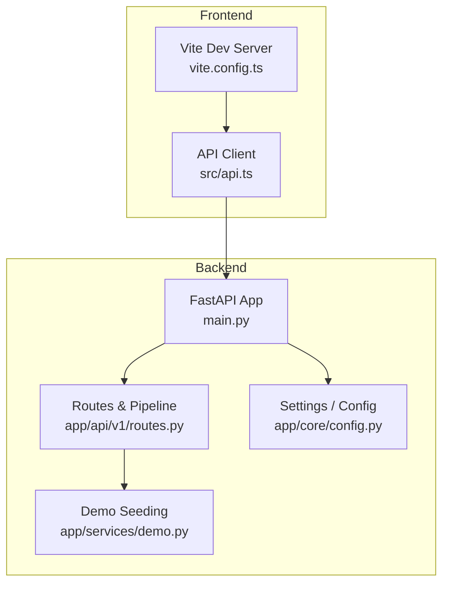
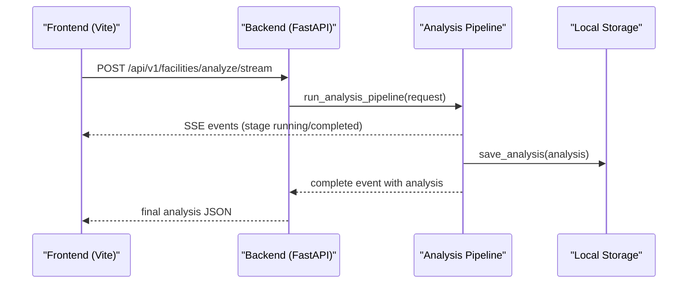
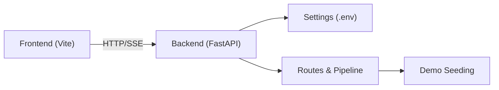

# Getting Started

<cite>
**Referenced Files in This Document**
- [README.md](file://README.md)
- [backend/main.py](file://backend/main.py)
- [backend/requirements.txt](file://backend/requirements.txt)
- [backend/app/core/config.py](file://backend/app/core/config.py)
- [backend/app/api/v1/routes.py](file://backend/app/api/v1/routes.py)
- [backend/app/services/demo.py](file://backend/app/services/demo.py)
- [frontend/package.json](file://frontend/package.json)
- [frontend/src/api.ts](file://frontend/src/api.ts)
- [frontend/vite.config.ts](file://frontend/vite.config.ts)
- [docs/ENV_SETUP.md](file://docs/ENV_SETUP.md)
</cite>

## Table of Contents
1. [Introduction](#introduction)
2. [Project Structure](#project-structure)
3. [Core Components](#core-components)
4. [Architecture Overview](#architecture-overview)
5. [Detailed Component Analysis](#detailed-component-analysis)
6. [Dependency Analysis](#dependency-analysis)
7. [Performance Considerations](#performance-considerations)
8. [Troubleshooting Guide](#troubleshooting-guide)
9. [Conclusion](#conclusion)
10. [Appendices](#appendices)

## Introduction
This guide helps you set up Carbon Compass quickly and run it locally with minimal friction. You will:
- Install prerequisites
- Set up the backend (Python FastAPI) with a virtual environment
- Configure environment variables for both backend and frontend
- Start the development servers
- Seed demo data
- Verify installation and explore the interactive API documentation

Carbon Compass can run fully in mock mode without any external API keys, which is ideal for local demos and quick starts.

## Project Structure
At a high level:
- Backend: FastAPI application under backend/, with configuration, routes, services, and schemas
- Frontend: React + Vite + TypeScript app under frontend/
- Data: Local cache directories under data/
- Docs: Environment setup reference under docs/

**Diagram sources**
- [backend/main.py:19-41](file://backend/main.py#L19-L41)
- [backend/app/api/v1/routes.py:35-35](file://backend/app/api/v1/routes.py#L35-L35)
- [backend/app/core/config.py:6-38](file://backend/app/core/config.py#L6-L38)
- [backend/app/services/demo.py:285-319](file://backend/app/services/demo.py#L285-L319)
- [frontend/vite.config.ts:4-15](file://frontend/vite.config.ts#L4-L15)
- [frontend/src/api.ts:9-15](file://frontend/src/api.ts#L9-L15)

**Section sources**
- [README.md:124-149](file://README.md#L124-L149)

## Core Components
- Backend server entrypoint that configures CORS, mounts routers, and exposes Swagger endpoints
- API router implementing the analysis pipeline, listing facilities, PDF export, demo seeding, and satellite image retrieval
- Settings module loading environment variables and exposing helper flags for live vs mock modes
- Frontend dev server configured to proxy API calls to the backend during development
- Frontend API client that reads environment variables and streams analysis events from the backend

Key responsibilities:
- Backend: orchestrate geocoding, satellite fetch, disclosure scraping, AI analysis, scoring, storage, and reporting
- Frontend: render UI, call backend APIs, stream SSE events, and display results

**Section sources**
- [backend/main.py:19-51](file://backend/main.py#L19-L51)
- [backend/app/api/v1/routes.py:208-299](file://backend/app/api/v1/routes.py#L208-L299)
- [backend/app/core/config.py:6-63](file://backend/app/core/config.py#L6-L63)
- [frontend/src/api.ts:9-108](file://frontend/src/api.ts#L9-L108)
- [frontend/vite.config.ts:4-15](file://frontend/vite.config.ts#L4-L15)

## Architecture Overview
The system follows a three-layer pipeline: data ingestion, AI analysis, and presentation. It degrades gracefully into mock mode when API keys are not provided.

**Diagram sources**
- [backend/app/api/v1/routes.py:68-205](file://backend/app/api/v1/routes.py#L68-L205)
- [backend/app/api/v1/routes.py:236-251](file://backend/app/api/v1/routes.py#L236-L251)
- [frontend/src/api.ts:59-107](file://frontend/src/api.ts#L59-L107)

## Detailed Component Analysis

### Backend Setup and Startup
- Create and activate a Python virtual environment in the backend directory
- Install dependencies from requirements.txt
- Optionally create a .env file for API keys; otherwise, mock mode is enabled automatically
- Start the server using uvicorn on port 8000
- Access Swagger at http://localhost:8000/docs

Environment variables are loaded from .env via the settings module. The server also sets CORS to allow the default frontend dev origins.

**Section sources**
- [backend/requirements.txt:1-12](file://backend/requirements.txt#L1-L12)
- [backend/app/core/config.py:6-38](file://backend/app/core/config.py#L6-L38)
- [backend/main.py:19-41](file://backend/main.py#L19-L41)

### Frontend Setup and Development Server
- Install Node.js dependencies with npm install
- Optionally configure VITE_API_BASE_URL if needed; defaults to http://localhost:8000
- Start the dev server with npm run dev
- The Vite dev server proxies /api requests to the backend automatically

**Section sources**
- [frontend/package.json:6-10](file://frontend/package.json#L6-L10)
- [frontend/src/api.ts:9-15](file://frontend/src/api.ts#L9-L15)
- [frontend/vite.config.ts:4-15](file://frontend/vite.config.ts#L4-L15)

### Environment Variables Configuration
Configure backend and frontend environment files as described below. All variables are optional; missing keys enable mock behavior.

Backend (.env)
- GEOCODING_API_KEY: Optional. If absent, geocoding runs in mock mode
- SENTINEL_HUB_CLIENT_ID / SENTINEL_HUB_CLIENT_SECRET: Optional. If absent, satellite imagery uses mock generation
- QWEN_API_KEY: Optional. If absent, AI analysis uses deterministic mock logic
- ALIBABA_OSS_*: Optional. If absent, storage falls back to local filesystem cache
- CONFIDENCE_THRESHOLD: Default 0.5. Minimum confidence required to issue a score
- SCORING_WEIGHT_SATELLITE / SCORING_WEIGHT_DISCLOSURE / SCORING_WEIGHT_SHIPPING: Defaults 0.4 / 0.4 / 0.2

Frontend (.env)
- VITE_API_BASE_URL: Default http://localhost:8000. Used by the frontend API client

Notes:
- The backend loads .env from its working directory via the settings class
- The frontend reads VITE_API_BASE_URL at runtime to construct API URLs

**Section sources**
- [docs/ENV_SETUP.md:3-25](file://docs/ENV_SETUP.md#L3-L25)
- [backend/app/core/config.py:6-38](file://backend/app/core/config.py#L6-L38)
- [frontend/src/api.ts:9-15](file://frontend/src/api.ts#L9-L15)

### Mock Mode Setup
When no API keys are configured:
- Geocoding returns pre-set coordinates for known locations
- Satellite imagery is generated synthetically
- Qwen analysis uses deterministic mock outputs
- Storage uses local filesystem cache under data/
- Shipping activity uses a proximity-based mock proxy

You can verify mock mode by calling the health endpoint.

**Section sources**
- [docs/ENV_SETUP.md:46-54](file://docs/ENV_SETUP.md#L46-L54)
- [backend/app/api/v1/routes.py:208-223](file://backend/app/api/v1/routes.py#L208-L223)

### Demo Data Seeding
Seed four pre-built facilities covering different risk scenarios:
- Via UI: click “Load Demo Data” on the dashboard
- Via curl: POST to the admin seed endpoint

After seeding, list or view analyses through the API or UI.

**Section sources**
- [README.md:192-198](file://README.md#L192-L198)
- [backend/app/api/v1/routes.py:287-290](file://backend/app/api/v1/routes.py#L287-L290)
- [backend/app/services/demo.py:285-319](file://backend/app/services/demo.py#L285-L319)

### API Endpoints and Usage Examples
Useful endpoints for getting started:
- GET /api/v1/health: Health check and mock/live status per API
- POST /api/v1/facilities/analyze: Full analysis pipeline (blocking)
- POST /api/v1/facilities/analyze/stream: Same pipeline via Server-Sent Events for progressive rendering
- GET /api/v1/facilities: List cached analyses (optional sector filter)
- GET /api/v1/facilities/{id}: Single analysis detail
- GET /api/v1/facilities/{id}/report.pdf: Export PDF report
- POST /api/v1/admin/seed-demo: Load demo dataset
- GET /api/v1/satellite/image/{filename}: Retrieve satellite image preview

SSE event stream format includes stage progress events and a final complete event with the full analysis object.

Interactive Swagger documentation is available at /docs.

**Section sources**
- [README.md:227-249](file://README.md#L227-L249)
- [backend/app/api/v1/routes.py:208-299](file://backend/app/api/v1/routes.py#L208-L299)

## Dependency Analysis
- Backend depends on FastAPI, Uvicorn, Pydantic, HTTP client, BeautifulSoup, PDF generation, Pillow, and optional OSS SDK
- Frontend depends on React, Vite, Axios, Leaflet, and related tooling
- The frontend dev server proxies API calls to the backend during development

**Diagram sources**
- [backend/requirements.txt:1-12](file://backend/requirements.txt#L1-L12)
- [frontend/package.json:11-29](file://frontend/package.json#L11-L29)
- [frontend/vite.config.ts:4-15](file://frontend/vite.config.ts#L4-L15)
- [backend/app/core/config.py:6-38](file://backend/app/core/config.py#L6-L38)
- [backend/app/api/v1/routes.py:208-299](file://backend/app/api/v1/routes.py#L208-L299)

**Section sources**
- [backend/requirements.txt:1-12](file://backend/requirements.txt#L1-L12)
- [frontend/package.json:11-29](file://frontend/package.json#L11-L29)
- [frontend/vite.config.ts:4-15](file://frontend/vite.config.ts#L4-L15)

## Performance Considerations
- Use the streaming endpoint (/facilities/analyze/stream) for better UX during long-running analyses
- Keep CORS origins aligned with your frontend dev server ports to avoid unnecessary retries
- In mock mode, all operations are local and fast; enabling real APIs may introduce network latency

[No sources needed since this section provides general guidance]

## Troubleshooting Guide
Common issues and resolutions:
- Port conflicts
  - Backend: Ensure port 8000 is free or change the startup command
  - Frontend: Vite defaults to port 5173; adjust if occupied
- CORS errors
  - Confirm the frontend origin matches the allowed origins in backend settings
  - During development, Vite proxies /api to the backend, avoiding cross-origin issues
- Missing API keys
  - Without keys, the app runs in mock mode; verify via /api/v1/health
- Frontend cannot reach backend
  - Check VITE_API_BASE_URL or ensure Vite proxy is active
- Demo data not visible
  - Call the seed endpoint or use the UI button to load demo facilities

Verification steps:
- Health check: GET /api/v1/health should return status ok and indicate mock/live per API
- Seed demo data: POST /api/v1/admin/seed-demo should return facility IDs
- List facilities: GET /api/v1/facilities should show seeded entries
- Run analysis: POST /api/v1/facilities/analyze or stream endpoint should return an analysis object
- Open Swagger: Visit /docs to explore and test endpoints interactively

**Section sources**
- [backend/main.py:19-51](file://backend/main.py#L19-L51)
- [backend/app/api/v1/routes.py:208-299](file://backend/app/api/v1/routes.py#L208-L299)
- [frontend/vite.config.ts:4-15](file://frontend/vite.config.ts#L4-L15)
- [docs/ENV_SETUP.md:26-44](file://docs/ENV_SETUP.md#L26-L44)

## Conclusion
You now have a working local instance of Carbon Compass. Start with mock mode to explore the full pipeline without external dependencies, then add API keys as needed. Use the interactive Swagger docs and the streaming endpoint to understand the analysis flow. Seed demo data to populate the UI and validate your setup.

[No sources needed since this section summarizes without analyzing specific files]

## Appendices

### Quick Start Checklist
- Prerequisites installed: Python 3.10+, Node.js 18+
- Backend:
  - Create and activate virtual environment
  - Install requirements
  - Start server on port 8000
- Frontend:
  - Install dependencies
  - Start dev server on port 5173
- Seed demo data via UI or curl
- Verify health and explore /docs

**Section sources**
- [README.md:151-198](file://README.md#L151-L198)
- [docs/ENV_SETUP.md:26-44](file://docs/ENV_SETUP.md#L26-L44)

### Environment Variables Reference
- Backend variables and defaults are documented in the environment setup guide
- Frontend variable VITE_API_BASE_URL controls the backend URL used by the client

**Section sources**
- [docs/ENV_SETUP.md:3-25](file://docs/ENV_SETUP.md#L3-L25)
- [backend/app/core/config.py:6-38](file://backend/app/core/config.py#L6-L38)
- [frontend/src/api.ts:9-15](file://frontend/src/api.ts#L9-L15)