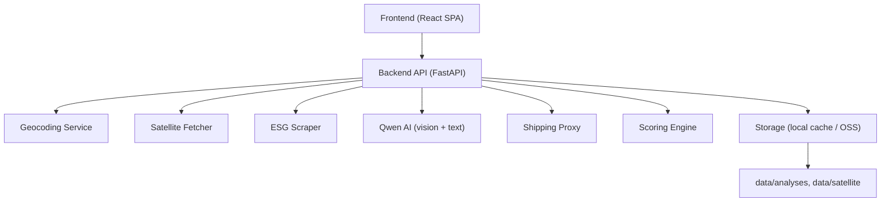
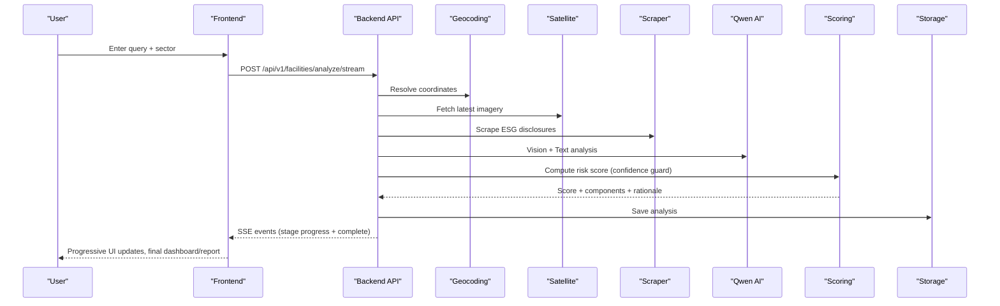
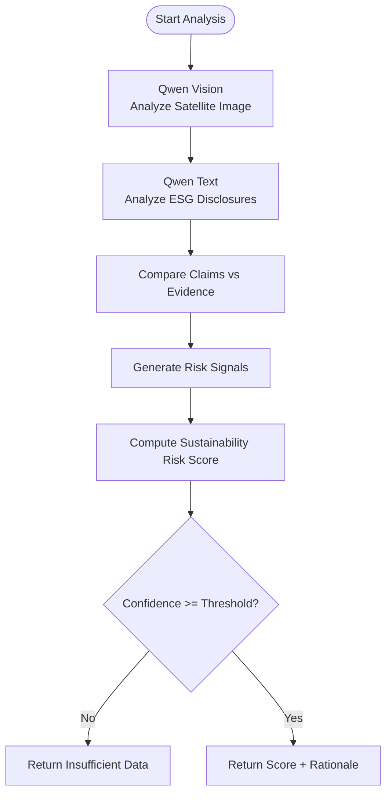
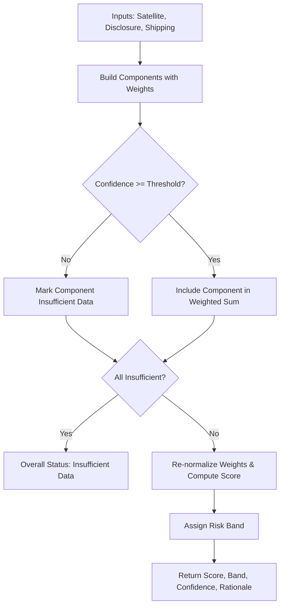
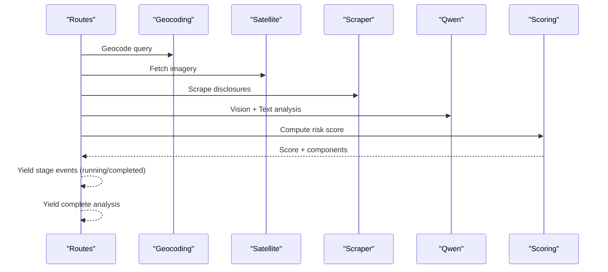
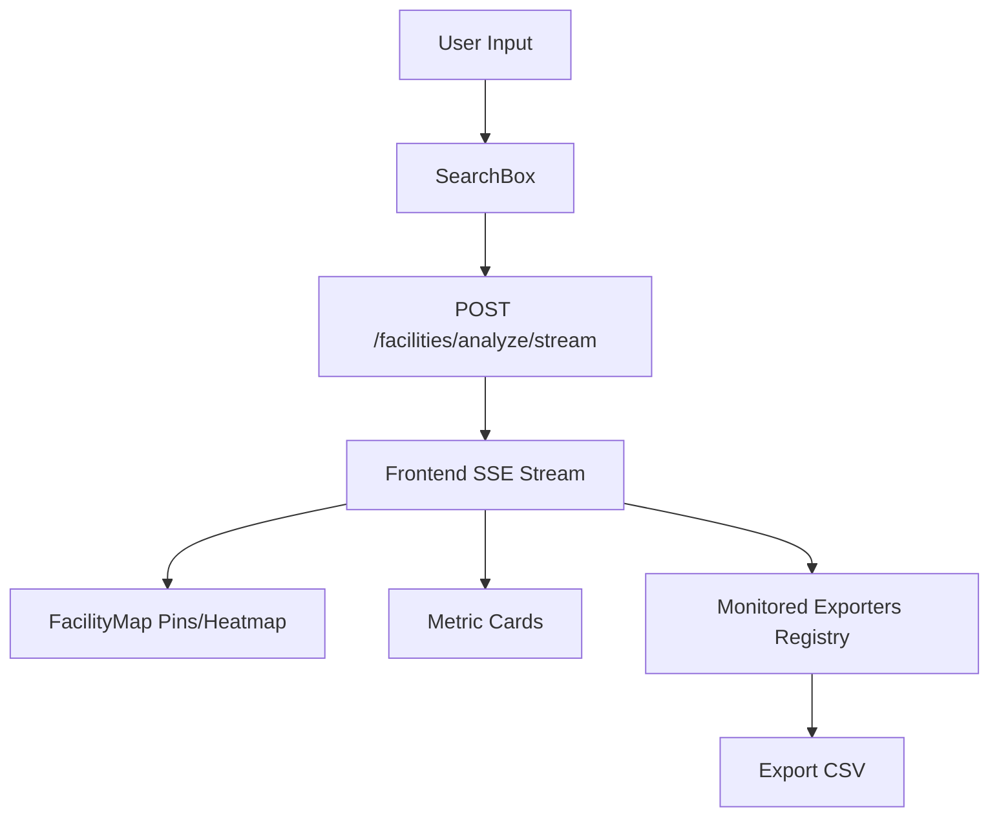
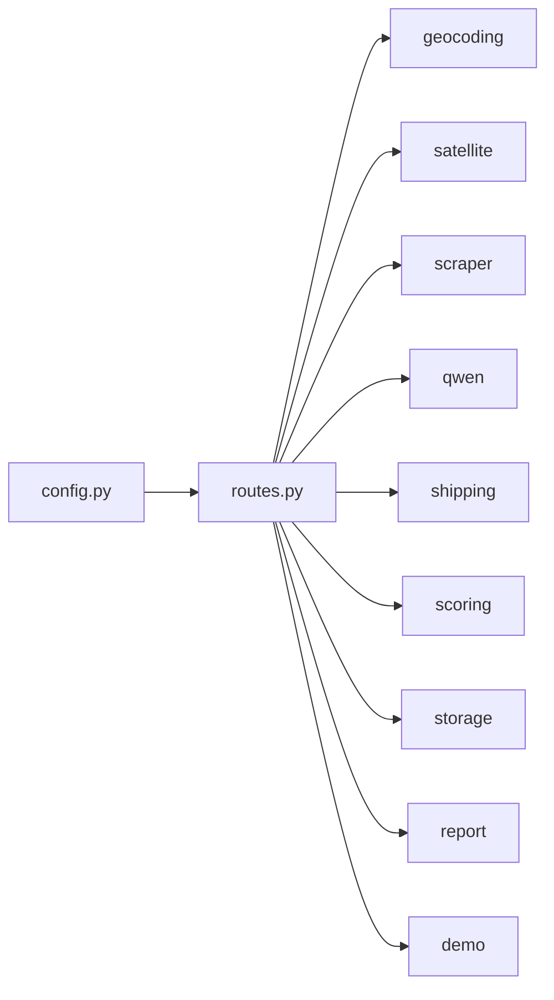

# Project Overview

<cite>
**Referenced Files in This Document**
- [README.md](file://README.md)
- [PRD.md](file://files/PRD.md)
- [architecture.md](file://files/architecture.md)
- [routes.py](file://backend/app/api/v1/routes.py)
- [qwen.py](file://backend/app/services/qwen.py)
- [scoring.py](file://backend/app/services/scoring.py)
- [config.py](file://backend/app/core/config.py)
- [DashboardPage.tsx](file://frontend/src/pages/DashboardPage.tsx)
- [SearchBox.tsx](file://frontend/src/components/SearchBox.tsx)
</cite>

## Table of Contents
1. [Introduction](#introduction)
2. [Project Structure](#project-structure)
3. [Core Components](#core-components)
4. [Architecture Overview](#architecture-overview)
5. [Detailed Component Analysis](#detailed-component-analysis)
6. [Dependency Analysis](#dependency-analysis)
7. [Performance Considerations](#performance-considerations)
8. [Troubleshooting Guide](#troubleshooting-guide)
9. [Conclusion](#conclusion)

## Introduction
Carbon Compass is an AI-powered supply chain sustainability risk platform built for the Alibaba Cloud AI Hackathon 2026 (Open Innovation track). It helps Pakistani textile, leather, and manufacturing exporters self-check environmental compliance risk before international buyers audit them. The system uses public data only, Qwen AI reasoning on Alibaba Cloud, and a strict confidence guard that returns Insufficient Data instead of guessing. Outputs are framed as decision-support risk signals, not formal audit findings.

Key positioning:
- Self-check tool for exporters and buyers to find risks early using public evidence.
- Not a replacement for formal audits; it provides actionable first-pass insights.
- Uses terminology consistent with the codebase: risk signals, confidence guard, sustainability risk score.

**Section sources**
- [README.md:1-55](file://README.md#L1-L55)
- [PRD.md:8-19](file://files/PRD.md#L8-L19)

## Project Structure
The repository is organized into three main layers:
- Frontend: React + Vite + TypeScript + Tailwind + Leaflet for interactive dashboards, maps, and reports.
- Backend: FastAPI + Pydantic for REST and SSE endpoints orchestrating the analysis pipeline.
- Services: Modular services for geocoding, satellite imagery, ESG scraping, Qwen AI analysis, shipping proxy, scoring, storage, reporting, and demo seeding.

**Diagram sources**
- [routes.py:68-205](file://backend/app/api/v1/routes.py#L68-L205)
- [architecture.md:3-38](file://files/architecture.md#L3-L38)

**Section sources**
- [README.md:124-149](file://README.md#L124-L149)
- [architecture.md:76-109](file://files/architecture.md#L76-L109)

## Core Components
- Search & Geocoding: Accepts company name, facility, or GPS coordinates and resolves to latitude/longitude.
- Satellite Analysis: Retrieves Sentinel-2 optical imagery and extracts observable indicators via Qwen vision.
- ESG Disclosure Scanning: Scrapes public sustainability disclosures and news mentions to extract stated claims.
- Risk Scoring: Weighted aggregation across satellite, disclosure, and shipping proxies with confidence thresholds.
- Confidence Guard: Any component below threshold returns Insufficient Data; if all components are insufficient, no fabricated score is issued.
- Interactive Visualization: Map with color-coded pins, heatmap toggle, filters, metric cards, and detailed facility panels.
- Forensic Report Export: Shareable PDF with executive summary, citations, and disclaimers.

These features align with the product’s mission to provide fast, low-cost, public-data-driven risk signals for SME exporters and buyers.

**Section sources**
- [README.md:40-71](file://README.md#L40-L71)
- [README.md:251-285](file://README.md#L251-L285)
- [PRD.md:30-46](file://files/PRD.md#L30-L46)

## Architecture Overview
Carbon Compass follows a three-layer pipeline:
- Layer 1 — Data Ingestion: Geocode, fetch satellite imagery, scrape ESG disclosures, retrieve shipping activity proxy; normalize outputs and store locally or in Alibaba Cloud OSS.
- Layer 2 — AI Analysis: Qwen vision analyzes satellite images; Qwen text analyzes disclosures; discrepancy engine compares claims vs. observations; scoring service computes weighted sustainability risk score with confidence guardrails.
- Layer 3 — Presentation: React SPA renders progressive results via Server-Sent Events, map visualizations, detail panels, and downloadable reports.

**Diagram sources**
- [routes.py:68-205](file://backend/app/api/v1/routes.py#L68-L205)
- [architecture.md:3-38](file://files/architecture.md#L3-L38)

**Section sources**
- [architecture.md:3-38](file://files/architecture.md#L3-L38)
- [README.md:73-105](file://README.md#L73-L105)

## Detailed Component Analysis

### Qwen AI Reasoning and Confidence Guard
- Vision analysis: Qwen reads satellite imagery to identify observable land-use changes, plume-like features, water discoloration, and thermal anomalies; returns structured observations, risk indicators, score, confidence, and rationale.
- Text analysis: Qwen extracts ESG claims about emissions targets, energy sources, waste/water management, and verification status; identifies discrepancies and gaps.
- Discrepancy detection: Compares satellite observations against disclosed claims to produce risk signals framed as follow-up suggestions rather than accusations.
- Mock fallback: When Qwen is not configured, deterministic mock analyses still respect the confidence guard and scoring formula.

**Diagram sources**
- [qwen.py:10-153](file://backend/app/services/qwen.py#L10-L153)
- [scoring.py:5-92](file://backend/app/services/scoring.py#L5-L92)

**Section sources**
- [qwen.py:10-153](file://backend/app/services/qwen.py#L10-L153)
- [scoring.py:5-92](file://backend/app/services/scoring.py#L5-L92)

### Scoring Engine and Risk Bands
- Weighted formula: sustainability risk score = (satellite signal × 0.4) + (disclosure discrepancy × 0.4) + (shipping proxy × 0.2), re-normalized when components are missing.
- Risk bands: Low (<30), Medium (30–60), High (>60), Unknown (Insufficient Data).
- Confidence guard: If any component’s confidence is below threshold, that component is marked Insufficient Data; if all are insufficient, overall status is Insufficient Data with no fabricated score.

**Diagram sources**
- [scoring.py:5-92](file://backend/app/services/scoring.py#L5-L92)
- [config.py:19-23](file://backend/app/core/config.py#L19-L23)

**Section sources**
- [scoring.py:5-92](file://backend/app/services/scoring.py#L5-L92)
- [config.py:19-23](file://backend/app/core/config.py#L19-L23)

### Pipeline Orchestration and Progressive Rendering
- Shared pipeline generator yields stage events for both JSON and SSE endpoints, enabling progressive rendering in the UI.
- Stages: geocoding_satellite → disclosure_scanning → ai_cross_analysis → risk_scoring.
- Each stage emits running/completed events with details, image references, acquisition dates, and final complete payload containing the full FacilityAnalysis.

**Diagram sources**
- [routes.py:68-205](file://backend/app/api/v1/routes.py#L68-L205)

**Section sources**
- [routes.py:68-205](file://backend/app/api/v1/routes.py#L68-L205)

### Frontend Interaction and Visualization
- SearchBox accepts queries and sector selection, submitting to the backend analysis endpoint.
- DashboardPage displays monitored facilities, filters by sector/region/risk band/date range, toggles between pins and heatmap, shows metric cards, and supports CSV export.
- DisclaimerBanner ensures legal and ethical framing in all views.

**Diagram sources**
- [SearchBox.tsx:1-88](file://frontend/src/components/SearchBox.tsx#L1-L88)
- [DashboardPage.tsx:76-186](file://frontend/src/pages/DashboardPage.tsx#L76-L186)
- [DashboardPage.tsx:375-489](file://frontend/src/pages/DashboardPage.tsx#L375-L489)

**Section sources**
- [SearchBox.tsx:1-88](file://frontend/src/components/SearchBox.tsx#L1-L88)
- [DashboardPage.tsx:76-186](file://frontend/src/pages/DashboardPage.tsx#L76-L186)
- [DashboardPage.tsx:375-489](file://frontend/src/pages/DashboardPage.tsx#L375-L489)

## Dependency Analysis
- Backend routes depend on services: geocoding, satellite, scraper, qwen, shipping, scoring, storage, report, demo.
- Configuration drives behavior: confidence threshold and scoring weights are read from settings; mock mode toggles based on presence of Qwen API key.
- Storage pattern: local-first cache with optional OSS mirror; reads prefer local with OSS fallback.

**Diagram sources**
- [routes.py:1-35](file://backend/app/api/v1/routes.py#L1-L35)
- [config.py:1-63](file://backend/app/core/config.py#L1-L63)

**Section sources**
- [routes.py:1-35](file://backend/app/api/v1/routes.py#L1-L35)
- [config.py:1-63](file://backend/app/core/config.py#L1-L63)

## Performance Considerations
- Progressive rendering via SSE reduces perceived latency and improves UX during long-running AI analysis.
- Local caching of analyses and satellite images avoids repeated network calls during demos.
- Mock mode ensures deterministic performance without external API dependencies.
- Re-normalization of weights prevents skew when some components are unavailable.

[No sources needed since this section provides general guidance]

## Troubleshooting Guide
- Health check reveals live vs mock status per API (geocoding, sentinel_hub, qwen, oss, shipping).
- If location resolution fails, the pipeline yields an error event with guidance to use GPS coordinates.
- Insufficient Data outcomes are expected when confidence thresholds are not met; verify environment variables and ensure public data availability.
- For demo purposes, seed demo data to populate the registry and test end-to-end flows.

**Section sources**
- [routes.py:208-223](file://backend/app/api/v1/routes.py#L208-L223)
- [routes.py:83-91](file://backend/app/api/v1/routes.py#L83-L91)
- [README.md:200-226](file://README.md#L200-L226)

## Conclusion
Carbon Compass delivers a practical, transparent, and ethically grounded approach to supply chain sustainability risk assessment. By combining public data, Qwen AI reasoning, and a robust confidence guard, it equips exporters and buyers with actionable risk signals and a clear path toward informed decisions—without fabricating answers when evidence is thin. Its three-layer architecture, progressive UI, and forensic reporting make it a strong decision-support tool aligned with the goals of the Alibaba Cloud AI Hackathon 2026.

[No sources needed since this section summarizes without analyzing specific files]