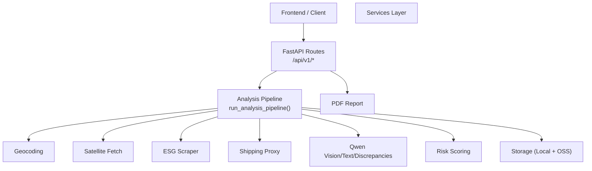
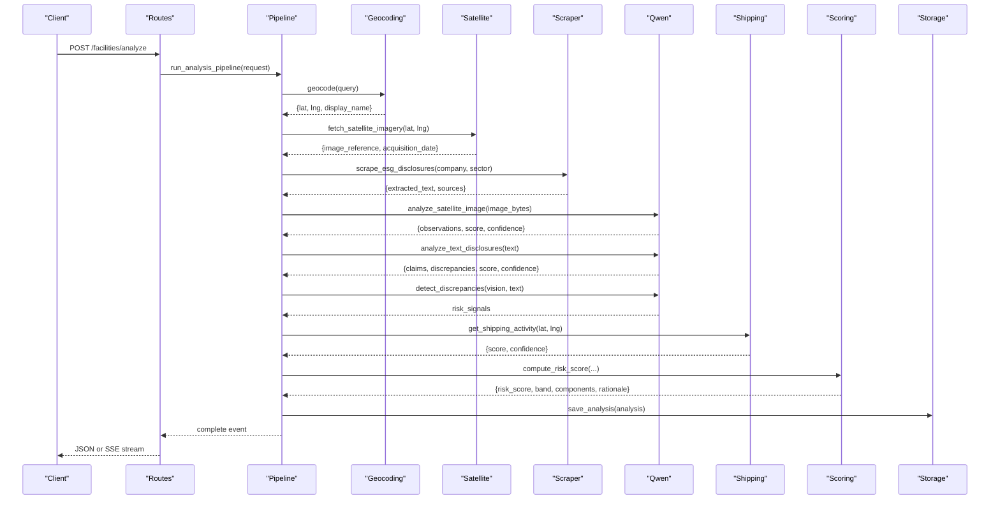
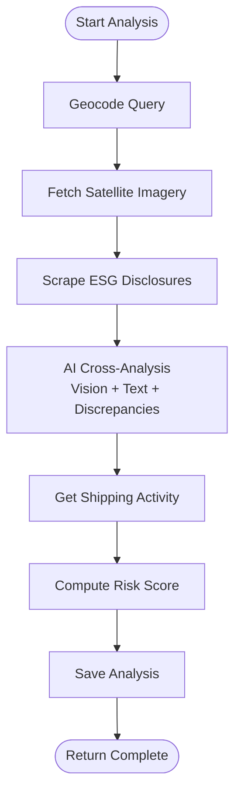
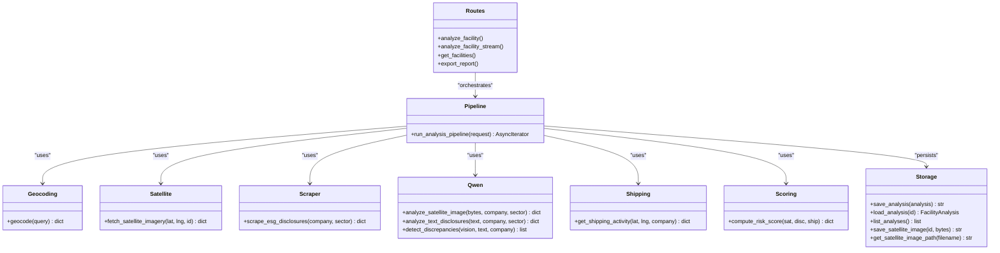
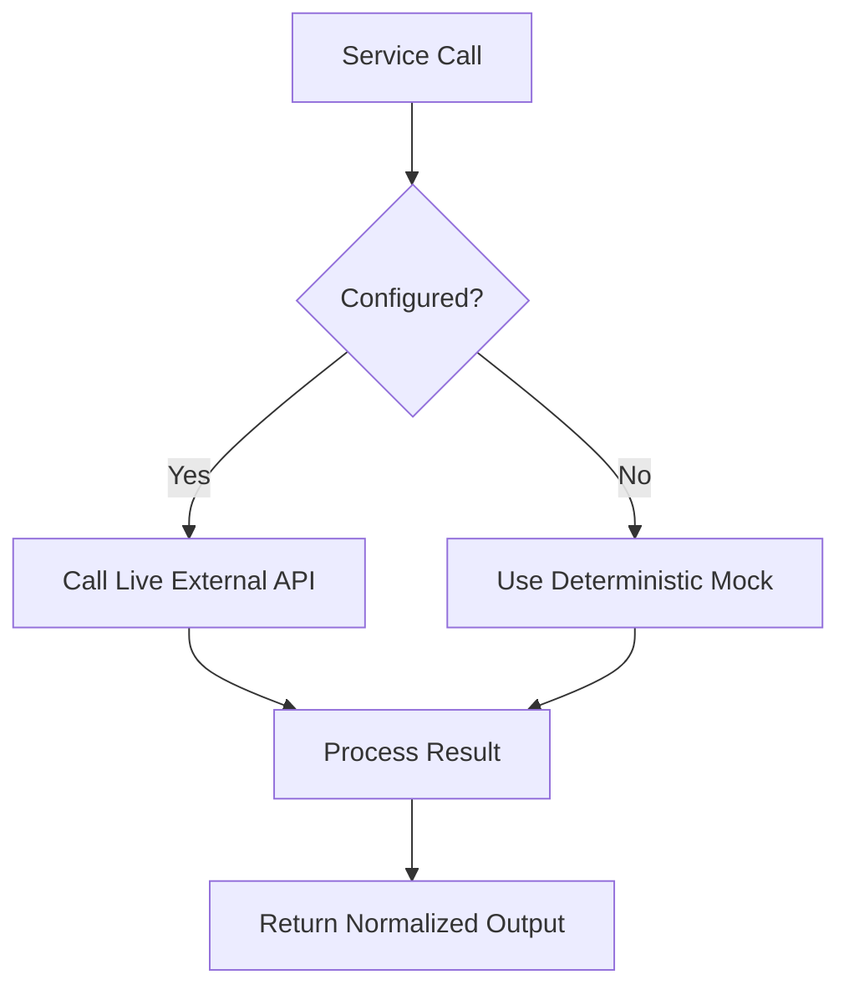
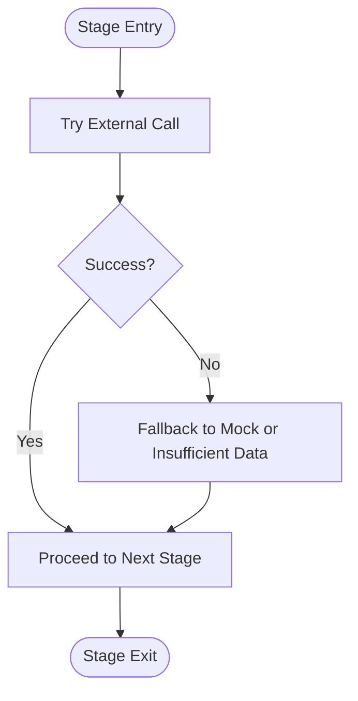
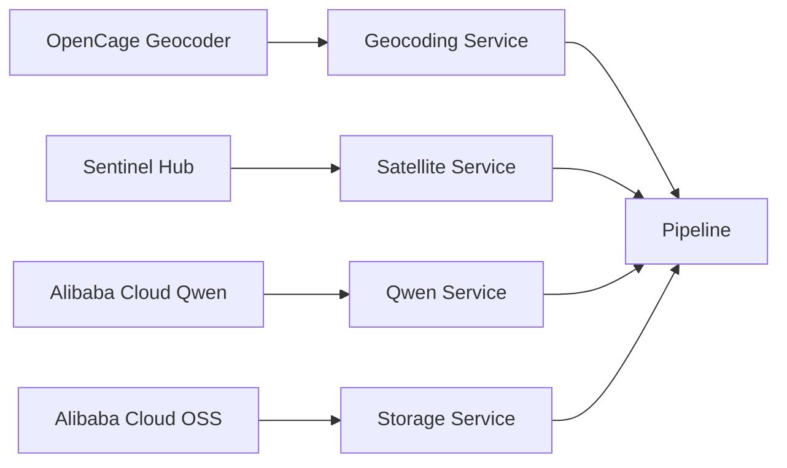
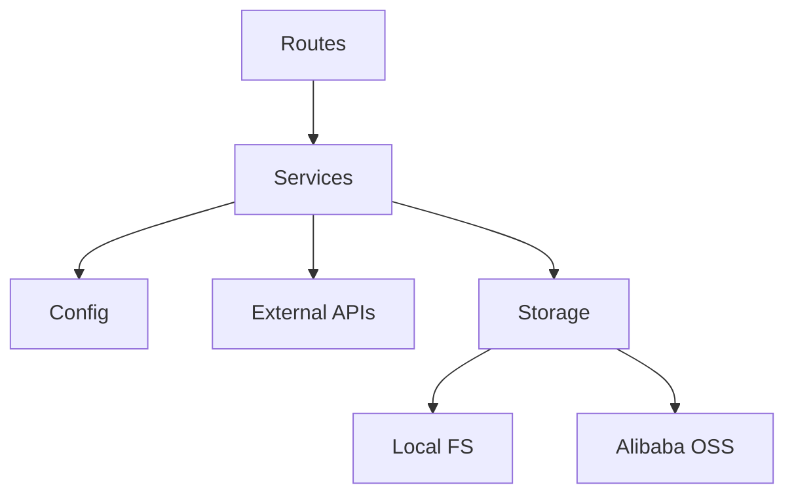

# System Architecture

<cite>
**Referenced Files in This Document**
- [main.py](file://backend/main.py)
- [routes.py](file://backend/app/api/v1/routes.py)
- [config.py](file://backend/app/core/config.py)
- [models.py](file://backend/app/schemas/models.py)
- [geocoding.py](file://backend/app/services/geocoding.py)
- [satellite.py](file://backend/app/services/satellite.py)
- [scraper.py](file://backend/app/services/scraper.py)
- [qwen.py](file://backend/app/services/qwen.py)
- [shipping.py](file://backend/app/services/shipping.py)
- [scoring.py](file://backend/app/services/scoring.py)
- [storage.py](file://backend/app/services/storage.py)
- [report.py](file://backend/app/services/report.py)
- [architecture.md](file://files/architecture.md)
- [README.md](file://README.md)
</cite>

## Table of Contents
1. Introduction
2. Project Structure
3. Core Components
4. Architecture Overview
5. Detailed Component Analysis
6. Dependency Analysis
7. Performance Considerations
8. Troubleshooting Guide
9. Conclusion
10. Appendices

## Introduction
Carbon Compass is a three-layer pipeline system that ingests public satellite imagery, ESG disclosures, and shipping/port activity proxies; analyzes them with AI (Alibaba Cloud Qwen); and presents risk insights through an interactive frontend. The design emphasizes graceful degradation: when any data source is unavailable or low-confidence, the system returns “Insufficient Data” rather than fabricating results. It exposes both synchronous and streaming endpoints for progressive UI updates via Server-Sent Events.

## Project Structure
The backend is organized into layers:
- API layer: FastAPI routes exposing REST and SSE endpoints
- Service layer: Ingestion (geocoding, satellite, scraping, shipping), AI analysis (Qwen vision/text/discrepancies), scoring, storage, and reporting
- Core: Configuration and Pydantic models
- Storage: Local filesystem cache with optional Alibaba Cloud OSS write-through

**Diagram sources**
- [routes.py:68-205](file://backend/app/api/v1/routes.py#L68-L205)
- [storage.py:1-141](file://backend/app/services/storage.py#L1-L141)
- [report.py:1-193](file://backend/app/services/report.py#L1-L193)

**Section sources**
- [main.py:1-52](file://backend/main.py#L1-L52)
- [routes.py:1-299](file://backend/app/api/v1/routes.py#L1-L299)
- [architecture.md:1-118](file://files/architecture.md#L1-L118)
- [README.md:73-149](file://README.md#L73-L149)

## Core Components
- API entrypoint and CORS setup
- Shared analysis pipeline generator yielding stage events
- Service modules implementing ingestion, AI analysis, scoring, storage, and reporting
- Configuration-driven strategy pattern enabling mock vs live modes
- Pydantic schemas defining request/response contracts

Key responsibilities:
- Geocoding: resolve company/address to coordinates or parse raw GPS
- Satellite: fetch Sentinel-2 imagery or generate synthetic image in mock mode
- ESG scraping: search and extract relevant text from public disclosures
- Qwen integration: analyze images and text, detect discrepancies
- Shipping proxy: proximity-based operational intensity signal
- Scoring: weighted aggregation with confidence thresholds
- Storage: local-first with OSS fallback
- Reporting: PDF generation with disclaimers

**Section sources**
- [config.py:1-63](file://backend/app/core/config.py#L1-L63)
- [models.py:1-78](file://backend/app/schemas/models.py#L1-L78)
- [geocoding.py:1-98](file://backend/app/services/geocoding.py#L1-L98)
- [satellite.py:1-175](file://backend/app/services/satellite.py#L1-L175)
- [scraper.py:1-158](file://backend/app/services/scraper.py#L1-L158)
- [qwen.py:1-315](file://backend/app/services/qwen.py#L1-L315)
- [shipping.py:1-57](file://backend/app/services/shipping.py#L1-L57)
- [scoring.py:1-157](file://backend/app/services/scoring.py#L1-L157)
- [storage.py:1-141](file://backend/app/services/storage.py#L1-L141)
- [report.py:1-193](file://backend/app/services/report.py#L1-L193)

## Architecture Overview
High-level flow:
- Ingestion: geocoding → satellite imagery → ESG scraping → shipping proxy
- AI analysis: Qwen vision on satellite image, Qwen text on disclosures, discrepancy detection
- Presentation: REST/SSE endpoints return progressive stages and final analysis; PDF export available

**Diagram sources**
- [routes.py:68-205](file://backend/app/api/v1/routes.py#L68-L205)
- [geocoding.py:24-98](file://backend/app/services/geocoding.py#L24-L98)
- [satellite.py:12-48](file://backend/app/services/satellite.py#L12-L48)
- [scraper.py:39-61](file://backend/app/services/scraper.py#L39-L61)
- [qwen.py:10-153](file://backend/app/services/qwen.py#L10-L153)
- [shipping.py:7-57](file://backend/app/services/shipping.py#L7-L57)
- [scoring.py:5-92](file://backend/app/services/scoring.py#L5-L92)
- [storage.py:78-100](file://backend/app/services/storage.py#L78-L100)

## Detailed Component Analysis

### Three-Layer Pipeline and Stage Flow
- Stage 1: Geocoding & Satellite
  - Resolves query to coordinates; fetches Sentinel-2 imagery or generates mock image
  - Graceful degradation if geocoding fails or imagery unavailable
- Stage 2: Disclosure Scanning
  - Scrapes public ESG content; returns insufficient_data when no text found
- Stage 3: AI Cross-Analysis
  - Qwen vision analyzes satellite image; Qwen text extracts claims; discrepancy detection compares evidence vs claims
- Stage 4: Risk Scoring
  - Weighted aggregation across satellite, disclosure, and shipping signals with confidence guard

**Diagram sources**
- [routes.py:68-205](file://backend/app/api/v1/routes.py#L68-L205)
- [scoring.py:5-92](file://backend/app/services/scoring.py#L5-L92)

**Section sources**
- [routes.py:68-205](file://backend/app/api/v1/routes.py#L68-L205)
- [architecture.md:40-62](file://files/architecture.md#L40-L62)

### Service Layer Pattern and Separation of Concerns
- API routes orchestrate the pipeline but delegate domain logic to services
- Each service encapsulates a single responsibility (e.g., geocoding, satellite fetching, scraping, AI calls, scoring, storage)
- Configuration drives behavior via properties like has_geocoding, has_sentinel, has_qwen, has_oss

**Diagram sources**
- [routes.py:1-299](file://backend/app/api/v1/routes.py#L1-L299)
- [geocoding.py:1-98](file://backend/app/services/geocoding.py#L1-L98)
- [satellite.py:1-175](file://backend/app/services/satellite.py#L1-L175)
- [scraper.py:1-158](file://backend/app/services/scraper.py#L1-L158)
- [qwen.py:1-315](file://backend/app/services/qwen.py#L1-L315)
- [shipping.py:1-57](file://backend/app/services/shipping.py#L1-L57)
- [scoring.py:1-157](file://backend/app/services/scoring.py#L1-L157)
- [storage.py:1-141](file://backend/app/services/storage.py#L1-L141)

**Section sources**
- [routes.py:1-299](file://backend/app/api/v1/routes.py#L1-L299)
- [config.py:1-63](file://backend/app/core/config.py#L1-L63)

### Strategy Pattern: Mock vs Live Modes
- Geocoding: uses OpenCage when key present; otherwise falls back to deterministic mock locations
- Satellite: uses Sentinel Hub Process API when credentials configured; otherwise generates synthetic PNG
- Qwen: calls Alibaba Cloud Model Studio when key present; otherwise returns deterministic mock analyses
- Storage: writes locally first; uploads to OSS when credentials and SDK are available; reads local-first with OSS fallback

**Diagram sources**
- [geocoding.py:24-98](file://backend/app/services/geocoding.py#L24-L98)
- [satellite.py:12-48](file://backend/app/services/satellite.py#L12-L48)
- [qwen.py:10-153](file://backend/app/services/qwen.py#L10-L153)
- [storage.py:29-76](file://backend/app/services/storage.py#L29-L76)

**Section sources**
- [geocoding.py:24-98](file://backend/app/services/geocoding.py#L24-L98)
- [satellite.py:12-48](file://backend/app/services/satellite.py#L12-L48)
- [qwen.py:10-153](file://backend/app/services/qwen.py#L10-L153)
- [storage.py:29-76](file://backend/app/services/storage.py#L29-L76)

### Error Handling and Graceful Degradation
- Geocoding errors fall back to mock; missing results yield resolved=False
- Satellite fetch errors or lack of imagery return insufficient_data status
- Scraper exceptions return mock ESG text; insufficient text yields insufficient_data
- Qwen call failures return mock analyses; discrepancy detection returns safe defaults
- Scoring excludes components below confidence threshold; if all insufficient, overall status is insufficient_data

**Diagram sources**
- [geocoding.py:39-70](file://backend/app/services/geocoding.py#L39-L70)
- [satellite.py:21-48](file://backend/app/services/satellite.py#L21-L48)
- [scraper.py:43-61](file://backend/app/services/scraper.py#L43-L61)
- [qwen.py:19-59](file://backend/app/services/qwen.py#L19-L59)
- [scoring.py:36-50](file://backend/app/services/scoring.py#L36-L50)

**Section sources**
- [geocoding.py:39-70](file://backend/app/services/geocoding.py#L39-L70)
- [satellite.py:21-48](file://backend/app/services/satellite.py#L21-L48)
- [scraper.py:43-61](file://backend/app/services/scraper.py#L43-L61)
- [qwen.py:19-59](file://backend/app/services/qwen.py#L19-L59)
- [scoring.py:36-50](file://backend/app/services/scoring.py#L36-L50)

### Integration Patterns with External Services
- OpenCage Geocoder: HTTP GET with timeout; error handling and mock fallback
- Sentinel Hub: OAuth token exchange and process API call; timeouts and error logging; mock image generation
- Alibaba Cloud Qwen: chat completions for vision and text; prompt constraints to avoid definitive pollution claims; robust JSON parsing and validation
- Alibaba Cloud OSS: best-effort upload; local-first read/write; bucket initialization guarded by imports and credentials

**Diagram sources**
- [geocoding.py:39-65](file://backend/app/services/geocoding.py#L39-L65)
- [satellite.py:50-114](file://backend/app/services/satellite.py#L50-L114)
- [qwen.py:19-105](file://backend/app/services/qwen.py#L19-L105)
- [storage.py:29-76](file://backend/app/services/storage.py#L29-L76)

**Section sources**
- [geocoding.py:39-65](file://backend/app/services/geocoding.py#L39-L65)
- [satellite.py:50-114](file://backend/app/services/satellite.py#L50-L114)
- [qwen.py:19-105](file://backend/app/services/qwen.py#L19-L105)
- [storage.py:29-76](file://backend/app/services/storage.py#L29-L76)

### Data Models and Contracts
- AnalyzeRequest: query string and optional sector hint
- FacilityAnalysis: comprehensive result including scores, components, signals, sources, and metadata
- ComponentResult: per-component status, score, confidence, observations, claims, and rationale
- HealthResponse: health status, version, mock_mode flag, and per-API live/mock indicators

**Section sources**
- [models.py:1-78](file://backend/app/schemas/models.py#L1-L78)

## Dependency Analysis
Coupling and cohesion:
- Routes depend on services; services depend on configuration and external APIs
- Storage abstracts local/OSS details; services remain decoupled from storage implementation
- Scoring depends on normalized outputs from other services; maintains high cohesion around risk computation

External dependencies:
- httpx for async HTTP requests
- BeautifulSoup for HTML parsing
- fpdf for PDF generation
- Optional oss2 for Alibaba Cloud OSS

**Diagram sources**
- [routes.py:1-299](file://backend/app/api/v1/routes.py#L1-L299)
- [config.py:1-63](file://backend/app/core/config.py#L1-L63)
- [storage.py:1-141](file://backend/app/services/storage.py#L1-L141)

**Section sources**
- [routes.py:1-299](file://backend/app/api/v1/routes.py#L1-L299)
- [config.py:1-63](file://backend/app/core/config.py#L1-L63)
- [storage.py:1-141](file://backend/app/services/storage.py#L1-L141)

## Performance Considerations
- Use asynchronous HTTP clients (httpx) with explicit timeouts to prevent blocking
- Stream pipeline progress via SSE to reduce perceived latency and enable progressive rendering
- Cache satellite images and analyses locally; use OSS as durable backup to avoid re-fetching
- Limit scraped text size and filter relevant paragraphs to reduce payload and processing time
- Normalize weights at scoring time to handle missing components without recomputation
- Consider connection pooling and retry strategies for external APIs in production deployments

[No sources needed since this section provides general guidance]

## Troubleshooting Guide
Common issues and mitigations:
- Geocoding failure: ensure valid coordinates or company name; check OpenCage key; verify network connectivity
- Satellite imagery unavailable: confirm Sentinel Hub credentials; review timeouts; accept mock mode for demos
- ESG scraping empty: adjust search queries; increase timeouts; rely on mock mode if necessary
- Qwen errors: validate API key; inspect prompts; ensure response parsing handles markdown-wrapped JSON
- OSS not reachable: verify credentials and SDK installation; local cache remains functional
- Scoring insufficient data: lower confidence threshold cautiously; investigate missing sources; review component rationales

Operational checks:
- Use /api/v1/health to verify live vs mock status for each integration
- Validate analysis persistence via /api/v1/facilities/{id}
- Export PDF reports to confirm end-to-end pipeline success

**Section sources**
- [routes.py:208-223](file://backend/app/api/v1/routes.py#L208-L223)
- [storage.py:78-100](file://backend/app/services/storage.py#L78-L100)
- [report.py:1-193](file://backend/app/services/report.py#L1-L193)

## Conclusion
Carbon Compass implements a robust three-layer pipeline with clear separation between ingestion, AI analysis, and presentation. The service layer pattern ensures modularity and testability, while the pipeline pattern orchestrates sequential stages with strong error handling and graceful degradation. Strategy patterns enable seamless switching between live and mock modes based on configuration. The system integrates with Alibaba Cloud Qwen and Sentinel Hub, supports scalable storage via OSS, and provides performance optimizations suitable for demo and production environments.

[No sources needed since this section summarizes without analyzing specific files]

## Appendices

### API Surface Summary
- Health check: /api/v1/health
- Full analysis: POST /api/v1/facilities/analyze
- Streaming analysis: POST /api/v1/facilities/analyze/stream
- List facilities: GET /api/v1/facilities
- Get facility: GET /api/v1/facilities/{id}
- Export report: GET /api/v1/facilities/{id}/report.pdf
- Seed demo: POST /api/v1/admin/seed-demo
- Satellite image: GET /api/v1/satellite/image/{filename}

**Section sources**
- [routes.py:208-299](file://backend/app/api/v1/routes.py#L208-L299)
- [README.md:227-249](file://README.md#L227-L249)

### Deployment Topology Options
- Single-host development: backend and frontend co-located; local filesystem cache only
- Containerized deployment: separate containers for backend and frontend; persistent volume for local cache; optional OSS integration
- Cloud-native: deploy backend behind API gateway; configure OSS for durable storage; scale horizontally with stateless workers; store artifacts in OSS

[No sources needed since this section provides general guidance]