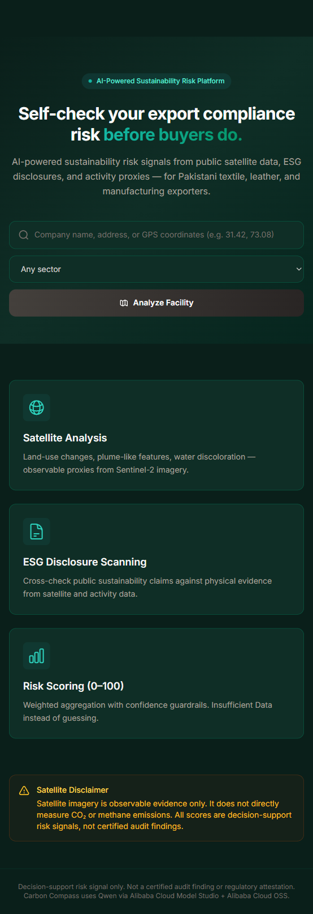
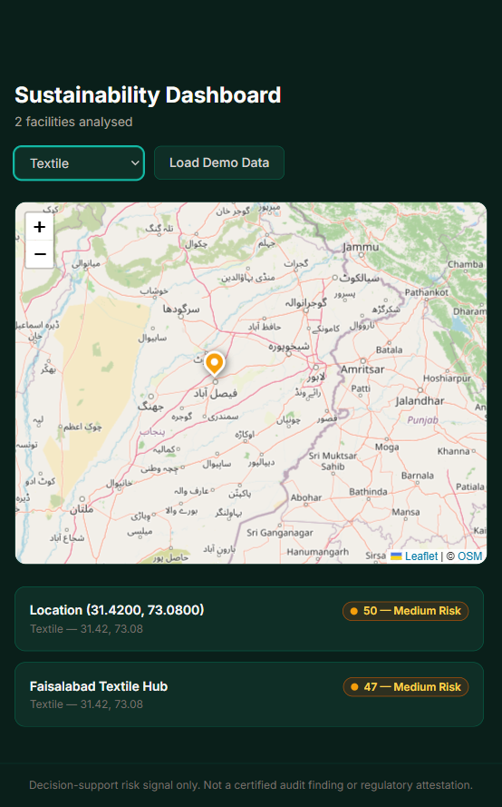

# Carbon Compass

**Self-check your export compliance risk before buyers do.**

Carbon Compass is an AI-powered supply chain sustainability risk platform built for the **Alibaba Cloud AI Hackathon 2026** (Open Innovation track). It helps Pakistani textile, leather, and manufacturing exporters self-check environmental compliance risk **before international buyers audit them** — using **public data only**, with **Qwen on Alibaba Cloud** for reasoning, and a strict **confidence guard** that returns **Insufficient Data** instead of guessing.





---

## Table of Contents

- [What It Does](#what-it-does)
- [Key Features](#key-features)
- [Architecture](#architecture)
- [Tech Stack](#tech-stack)
- [Project Structure](#project-structure)
- [Quick Start](#quick-start)
- [Environment Variables](#environment-variables)
- [API Endpoints](#api-endpoints)
- [Scoring Engine](#scoring-engine)
- [Demo Dataset](#demo-dataset)
- [Mock Mode](#mock-mode)
- [Testing](#testing)
- [Legal & Ethical Guardrails](#legal--ethical-guardrails)
- [Known Limitations](#known-limitations)

---

## What It Does

A user enters a **company name, address, or GPS coordinates** for a facility. Carbon Compass then:

1. **Geocodes** the input to latitude/longitude (OpenCage or coordinates parsing)
2. **Fetches public satellite imagery** (Sentinel Hub, Sentinel-2 optical) for that location
3. **Scrapes public ESG/sustainability disclosures** and news mentions
4. **Retrieves shipping/port activity** as an operational-intensity proxy
5. **Runs AI analysis** (Qwen vision + text) to detect observable signals and extract stated claims
6. **Compares claims vs evidence** and flags discrepancies as **Risk Signals** (never accusations)
7. **Computes a Sustainability Risk Score (0–100)** using the weighted formula with confidence thresholds
8. **Displays results** on an interactive map with red/amber/green risk pins, a regional heatmap, and a detailed facility panel
9. **Exports a shareable PDF report** with legal disclaimers

> **Positioning:** A cheap, fast, self-serve **first pass** — not a replacement for formal audits. Outputs are **decision-support risk signals**, not certified compliance findings.

## Key Features

- **Search & Geocoding** — company name, address, or raw GPS coordinates (e.g. `31.42, 73.08`)
- **Satellite Analysis** — land-use changes, plume-like features, water discoloration (observable proxies only)
- **ESG Disclosure Scanning** — cross-check public sustainability claims against physical evidence
- **Risk Scoring (0–100)** — weighted aggregation (40% satellite / 40% disclosure / 20% shipping) with confidence guardrails
- **Confidence Guard** — any component below the confidence threshold returns **Insufficient Data**, never a fabricated score
- **Interactive Dashboard** — Leaflet map with colour-coded pins (green/amber/red/grey) and sector filtering
- **Facility Detail Panel** — score breakdown, satellite preview, extracted claims, risk signals, plain-language rationale, and data-source citations
- **PDF Report Export** — shareable report with the full legal disclaimer block
- **Demo Dataset** — 4 pre-seeded facilities covering all risk scenarios, including an intentional insufficient-data case
- **Light/Dark Theme** — respects `prefers-color-scheme`, toggleable in the header
- **Responsive Design** — works on desktop, laptop, tablet, and mobile
- **Mock Mode** — the full app runs without any API keys for demos

## Architecture

Carbon Compass follows a **three-layer pipeline**. Each layer **degrades gracefully** — returning **Insufficient Data** instead of guessing when evidence is thin.

```
┌─────────────────┐  ┌──────────────────┐  ┌─────────────────┐
│  Sentinel Hub   │  │ Public ESG /     │  │ Shipping / Port │
│  (optical proxy)│  │ annual reports   │  │ activity proxy  │
└────────┬────────┘  └────────┬─────────┘  └────────┬────────┘
         │                    │                      │
         └────────────────────┼──────────────────────┘
                              ▼
              ┌───────────────────────────────┐
              │  Layer 1: Data Ingestion      │
              │  Fetch · scrape · normalise   │
              │  → Alibaba Cloud OSS / cache  │
              └───────────────┬───────────────┘
                              ▼
              ┌───────────────────────────────┐
              │  Layer 2: AI Analysis         │
              │  Qwen vision + text reasoning │
              │  Weighted risk score (0–100)  │
              │  Confidence guard             │
              └───────────────┬───────────────┘
                              ▼
              ┌───────────────────────────────┐
              │  Layer 3: Presentation        │
              │  Map · heatmap · reports      │
              │  → Exporter / buyer           │
              └───────────────────────────────┘
```

**Alibaba Cloud integration:** Qwen (Model Studio) for text and vision reasoning, Alibaba Cloud OSS for image/report storage (with local filesystem cache fallback).

## Tech Stack

| Layer | Technology |
|-------|-----------|
| Frontend | React 18 + Vite + TypeScript + Tailwind CSS |
| Routing | React Router v6 |
| Map / Heatmap | Leaflet (react-leaflet) |
| HTTP Client | Axios |
| Backend | FastAPI (Python) + Pydantic schemas |
| Geocoding | OpenCage Geocoder (mock fallback) |
| Satellite | Sentinel Hub Process API — Sentinel-2 L2A |
| Scraping | httpx + BeautifulSoup (DuckDuckGo search) |
| AI / LLM | Qwen (`qwen-vl-max` + `qwen-max`) via Alibaba Cloud Model Studio |
| Storage | Alibaba Cloud OSS (optional) / local JSON cache |
| PDF Export | fpdf2 |
| Fonts | Inter |

## Project Structure

```
carbon-compass/
├── frontend/              React + Vite + Tailwind + Leaflet
│   └── src/
│       ├── pages/         LandingPage, DashboardPage, FacilityDetailPage
│       ├── components/    AppHeader, FacilityMap, RiskBadge, SearchBox
│       ├── context/       ThemeContext (light/dark)
│       ├── types/         TypeScript interfaces
│       └── api.ts         Typed API client
├── backend/               FastAPI + Pydantic
│   └── app/
│       ├── api/v1/        REST routes
│       ├── services/      geocoding, satellite, scraper, qwen, shipping,
│       │                  scoring, storage, report (PDF), demo (seed)
│       ├── core/          config, settings
│       └── schemas/       Pydantic request/response models
├── data/                  Local cache (analyses JSON, satellite images)
├── docs/                  ENV_SETUP.md, screenshots, spec
└── scripts/               test.ps1 (E2E smoke tests)
```

## Quick Start

### Prerequisites

- Python 3.10+
- Node.js 18+
- (Optional) API keys: OpenCage, Sentinel Hub, Alibaba Cloud Model Studio

### 1. Backend

```bash
cd backend
pip install -r requirements.txt

# Configure environment (optional — mock mode works without keys)
cp .env.example .env        # Windows: copy .env.example .env

# Start the server
uvicorn main:app --reload --port 8000
```

The API is now live at `http://localhost:8000` with Swagger docs at `http://localhost:8000/docs`.

### 2. Frontend

```bash
cd frontend
npm install

# Configure environment (optional)
cp .env.example .env        # Windows: copy .env.example .env

# Start the dev server
npm run dev
```

The app is now live at `http://localhost:5173` (or the next free port).

### 3. Seed Demo Data

Either click **Load Demo Data** on the dashboard, or:

```bash
curl -X POST http://localhost:8000/api/v1/admin/seed-demo
```

## Environment Variables

All keys are stored **server-side only** — never in the React bundle or git. See [docs/ENV_SETUP.md](docs/ENV_SETUP.md) for the full reference.

**Backend (`backend/.env`):**

| Variable | Required | Default | Description |
|----------|----------|---------|-------------|
| `GEOCODING_API_KEY` | No | (mock) | OpenCage API key for geocoding |
| `SENTINEL_HUB_CLIENT_ID` | No | (mock) | Sentinel Hub OAuth client ID |
| `SENTINEL_HUB_CLIENT_SECRET` | No | (mock) | Sentinel Hub OAuth client secret |
| `QWEN_API_KEY` | No | (mock) | Alibaba Cloud Model Studio API key |
| `ALIBABA_OSS_ACCESS_KEY_ID` | No | (local) | Alibaba Cloud OSS access key |
| `ALIBABA_OSS_ACCESS_KEY_SECRET` | No | (local) | Alibaba Cloud OSS secret |
| `ALIBABA_OSS_BUCKET_NAME` | No | (local) | OSS bucket name |
| `ALIBABA_OSS_ENDPOINT` | No | (local) | OSS endpoint URL |
| `CONFIDENCE_THRESHOLD` | No | 0.5 | Min confidence for a valid score |
| `SCORING_WEIGHT_SATELLITE` | No | 0.4 | Satellite weight in scoring |
| `SCORING_WEIGHT_DISCLOSURE` | No | 0.4 | Disclosure weight in scoring |
| `SCORING_WEIGHT_SHIPPING` | No | 0.2 | Shipping weight in scoring |

**Frontend (`frontend/.env`):**

| Variable | Required | Default | Description |
|----------|----------|---------|-------------|
| `VITE_API_BASE_URL` | No | http://localhost:8000 | Backend API URL |

## API Endpoints

| Method | Path | Description |
|--------|------|-------------|
| `GET` | `/api/v1/health` | Health check + configuration status (which APIs are live vs mock) |
| `POST` | `/api/v1/facilities/analyze` | Full analysis pipeline (geocode → ingest → analyse → score) |
| `GET` | `/api/v1/facilities` | List all cached analyses |
| `GET` | `/api/v1/facilities/{id}` | Single analysis detail |
| `GET` | `/api/v1/facilities/{id}/report.pdf` | Export PDF report |
| `GET` | `/api/v1/heatmap` | Map pins for dashboard (coordinates + risk band) |
| `POST` | `/api/v1/admin/seed-demo` | Load the pre-built demo dataset |
| `GET` | `/api/v1/satellite/image/{filename}` | Satellite image preview |

Interactive Swagger docs are available at `/docs`.

## Scoring Engine

### Weighted Formula

```
risk_score = (
  0.40 × satellite_signal +
  0.40 × disclosure_discrepancy +
  0.20 × shipping_proxy
)
// Weights are re-normalised when components are missing
```

All weights and thresholds live in **config** (`backend/app/core/config.py`) — never hardcoded in prompts.

### Risk Bands

| Band | Score Range | Colour |
|------|-------------|--------|
| Green (Low) | < 30 | `#22C55E` / `#4ADE80` |
| Amber (Medium) | 30 – 60 | `#F59E0B` / `#FBBF24` |
| Red (High) | > 60 | `#EF4444` / `#F87171` |
| Unknown | Insufficient Data | Grey |

### Confidence Guard

```
IF confidence(satellite)  < THRESHOLD → component = "Insufficient Data"
IF confidence(disclosure) < THRESHOLD → component = "Insufficient Data"
IF confidence(shipping)   < THRESHOLD → component = "Insufficient Data"
IF all_components_insufficient → overall = "Insufficient Data" (no fabricated score)
ELSE → compute weighted score on available components only; disclose missing inputs
```

Default confidence threshold: **0.5** (configurable via `CONFIDENCE_THRESHOLD`).

## Demo Dataset

Four pre-seeded facilities covering all risk scenarios:

| Facility | Sector | Coordinates | Risk Band | Purpose |
|----------|--------|-------------|-----------|---------|
| Faisalabad Textile Hub | Textile | 31.418, 73.079 | Amber (47) | Typical export compliance narrative |
| Kasur Leather Belt | Leather | 31.12, 74.45 | Red (72) | Elevated risk signals demo |
| Sialkot Manufacturing Zone | Manufacturing | 32.49, 74.53 | Green (18) | Low-risk positive example |
| Lahore Industrial Zone (Sparse Data) | Mixed | 31.52, 74.36 | Unknown (Insufficient Data) | **Intentional** insufficient-data demo |

Demo facility names are sector/region descriptive — no accusatory framing of real named companies.

## Mock Mode

When API keys are not set, the app runs in **deterministic mock mode** — the entire pipeline still works:

- **Geocoding** — returns pre-set coordinates for known Pakistani locations
- **Satellite** — generates synthetic imagery locally
- **Qwen analysis** — deterministic mock analysis that still respects the confidence guard and scoring formula
- **OSS** — falls back to the local filesystem cache (`data/`)
- **Shipping** — port-proximity-based mock proxy

Mock mode is clearly indicated in the `/api/v1/health` endpoint. Live vs mock status per API:

```json
{
  "mock_mode": true,
  "apis": {
    "geocoding": "mock",
    "sentinel_hub": "mock",
    "qwen": "mock",
    "oss": "local_cache",
    "shipping": "mock_proxy"
  }
}
```

## Testing

An end-to-end smoke test script is included:

```powershell
# PowerShell (backend must be running on :8000)
.\scripts\test.ps1
```

It verifies: health check, demo seeding, facility listing, heatmap population, the insufficient-data guard (no fabricated score), PDF export, and a live analysis run.

## Legal & Ethical Guardrails

These apply to **code, prompts, UI copy, and PDF exports**:

1. **Never assert definitive pollution or non-compliance** about a named real company
2. All outputs are framed as **risk signals for further investigation**
3. Public demo materials use **anonymised or sector-descriptive names** for sensitive findings
4. Every score is accompanied by a **visible confidence indicator** and **data-source citation**
5. Satellite limitations are stated clearly and repeatedly:

   > Satellite imagery is observable evidence only. It does not directly measure CO₂ or methane emissions.

6. Risk scores are labelled as **decision-support signals**, not audit findings:

   > Decision-support risk signal only. Not a certified audit finding or regulatory attestation.

**Language rules:** the UI says *"Risk Signal"*, *"Suggested Follow-up"*, and *"Insufficient Data"* — never *"polluting"*, *"non-compliant"*, or *"violation"*.

## Known Limitations

- **Satellite resolution** — Sentinel-2 (10–20 m) detects visible proxies only, not facility-level gas emissions
- **Scraping coverage** — public ESG disclosure search depends on what companies publish; rate limits may apply
- **Shipping proxy** — port-proximity-based approximation, not real AIS vessel tracking
- **Mock mode** — without API keys, satellite imagery is synthetic and Qwen analysis is deterministic simulation
- **No PII** — the prototype collects no personal data from end users

## License

Built for the Alibaba Cloud AI Hackathon 2026 — Open Innovation track.
